# Dotfiles: An Opinionated Python Development Environment


This repository contains a set of dotfiles that create a seamless and highly automated Python development workflow on macOS. It is built around a modern toolchain that prioritizes speed, consistency, and best practices.

The core principle is **convention over configuration**. By using the provided functions and aliases, you can bootstrap, manage, and clean up complex Python projects with single commands, all while `uv`, `direnv`, and `pipx` handle the heavy lifting.

## Core Philosophy & Key Technologies

This setup standardizes on a specific set of tools to create a zero-friction experience:

*   **`uv`**: The primary tool for **everything** Python. It's used as a lightning-fast package manager (`pip`), virtual environment manager (`venv`), and command runner.
*   **`direnv`**: Provides **automatic environment activation**. Simply `cd` into a project directory, and your `.venv` is sourced. `cd` out, and it's deactivated. No more `source .venv/bin/activate`.
*   **`pipx`**: The standard for installing Python command-line applications. It installs them into isolated environments, ensuring no dependency conflicts on your system.
*   **`Zsh` + `Oh My Zsh`**: The shell foundation, providing powerful completions, plugins, and the customization framework.
*   **`Homebrew`**: The assumed package manager for installing system-level dependencies on macOS.

## The Workflow at a Glance

This diagram illustrates the entire lifecycle of a project using this automated setup.

```mermaid
graph TD
    subgraph "1. Project Creation (One-Time)"
        A[mkdir my-project & cd my-project] --> B[run: **python_new_project 3.12**]
        B --> C{Project Scaffolding Done}
        C --> D[Git Repo Initialized]
        C --> E[.venv Created & Dependencies Installed]
        C --> F[.envrc Created for direnv]
    end

    subgraph "2. Daily Development (Automatic & Seamless)"
        G[cd my-project] --> H{direnv auto-runs .envrc}
        H --> I["✅ **.venv is activated**"]
        I --> J[Write code, run 'pytest', 'ruff', etc.]
        J --> K[cd ..]
        K --> L["❌ **.venv is deactivated**"]
    end

    subgraph "3. Deployment (Optional CLI Tooling)"
        M[run: **pipx_install_current_project**] --> N[CLI tool available globally]
    end

    %% Transition from creation to daily workflow
    B -.-> G
```



## Key Features

*   🚀 **Blazing Fast Automation**: Use `uv` for near-instant dependency installation and environment creation.
*   🏗️ **Comprehensive Scaffolding**: The `python_new_project` function generates a complete, best-practice project structure with a single command.
*   ✨ **Zero-Friction Activation**: `direnv` handles virtual environment activation and deactivation automatically, so you never have to think about it.
*   📦 **Reproducible Environments**: Strictly uses `pyproject.toml` for dependency definition, ensuring consistent setups everywhere.
*   🔧 **Isolated CLI Tools**: A dedicated `pipx` workflow allows you to safely install your project's command-line tools for global use without conflicts.
*   ✅ **Best Practices by Default**: The generated projects are pre-configured with:
    *   **Ruff** for linting and formatting.
    *   **Pytest** for testing with coverage.
    *   A sensible `.gitignore` and `README.md` template.
    *   Optimized VSCode settings for an integrated experience.

## Prerequisites & Installation

1.  **Homebrew**: Ensure [Homebrew](https://brew.sh/) is installed on your macOS system.
2.  **Core Tools**: Install the key technologies using Homebrew.
    ```bash
    brew install uv direnv pipx
    ```
3.  **Clone this Repository**:
    ```bash
    git clone <your-repo-url> ~/dotfiles
    ```
4.  **Symlink Configuration**: Link the `.zshrc` and `.zsh_functions` files to your home directory.
    ```bash
    # WARNING: This will overwrite existing files. Backup yours first!
    ln -sf ~/dotfiles/.zshrc ~/.zshrc
    ln -sf ~/dotfiles/.zsh_functions ~/.zsh_functions
    ```
5.  **Enable `direnv`**: The provided `.zshrc` already contains the hook for `direnv`. If you are merging with an existing file, ensure this line is present:
    ```zsh
    # In your .zshrc
    if command -v direnv &> /dev/null; then eval "$(direnv hook zsh)"; fi
    ```
6.  **Restart Your Shell**: Open a new terminal window or run `source ~/.zshrc` to apply all changes.

---

## Usage: Your Day-to-Day Workflow

### 1. Creating a New Python Project

This is the primary entry point. The function scaffolds everything you need.

```bash
# 1. Create and enter a directory for your new project
mkdir my-awesome-app && cd my-awesome-app

# 2. Run the new project command with the desired Python version
python_new_project 3.12
```

This single command performs over a dozen steps, including `git init`, `uv venv`, `uv pip install`, and creating all necessary config files.

### 2. Setting Up an Existing Project

If you clone a project or need to reset your environment, use `python_setup`.

```bash
# 1. Clone a repo and enter it
git clone <url> && cd <project-name>

# 2. Set up the environment
python_setup 3.12
```

This will safely remove any old `.venv`, create a new one with the specified Python version, install all dependencies from `pyproject.toml`, and ensure `direnv` is ready.

### 3. Creating a Command-Line Tool

If your `pyproject.toml` defines a script, you can install it as a system-wide command using `pipx`.

```bash
# Inside your project directory:

# Install the tool for the first time
pipx_install_current_project

# After making changes to your code, reinstall to update the tool
pipx_reinstall_current_project

# Uninstall the tool
pipx_uninstall_current_project
```

### 4. Cleaning Up a Project

To completely remove all generated artifacts and return the directory to a clean state, use `python_delete`.

```bash
# This will remove .venv, caches, build artifacts, uv.lock, and .envrc
python_delete
```

## Generated Project Structure

Running `python_new_project` results in the following structure:

```bash
project_name/
├── .env              # For local environment variables (in .gitignore)
├── .gitignore        # A comprehensive gitignore for Python projects
├── .venv/            # The local virtual environment managed by uv
├── .vscode/
│   └── settings.json # Pre-configured VSCode settings for this project
├── README.md         # A template README for your project
├── pyproject.toml    # The heart of your project: metadata, dependencies, and tool configs
├── src/
│   └── project_name/
│       ├── __init__.py # Makes the directory a package (with __version__)
│       └── main.py     # Example entrypoint script
└── tests/
    ├── __init__.py
    └── test_main.py  # Example test file for pytest
```

---

## Full Function & Alias Reference

### Core Functions

| Function | Arguments | Description |
| :--- | :--- | :--- |
| `python_new_project` | `<py_version>` | Scaffolds a complete new Python project in the current directory. |
| `python_setup` | `<py_version>` | Resets/creates the `.venv` and installs dependencies for an existing project. |
| `python_delete` | (none) | Deletes the `.venv`, caches, build artifacts, and `.envrc`. |
| `python_deactivate` | (none) | Deactivates the current virtual environment. |
| `get_uv_python_path` | `<py_version>` | (Helper) Prints the path to a `uv`-managed Python interpreter. |
| `pipx_install_current_project` | (none) | Installs the current project as a global CLI tool via `pipx`. |
| `pipx_reinstall_current_project` | (none) | Updates the globally installed CLI tool from local source. |
| `pipx_uninstall_current_project` | (none) | Uninstalls the `pipx`-managed CLI tool for the current project. |

### Convenience Aliases

| Alias(es) | Maps To |
| :--- | :--- |
| `py_new`, `py_new_project`, `python_new` | `python_new_project` |
| `py_setup`, `py_existing`, `python_existing` | `python_setup` |
| `py_off`, `py_close`, `py_deactivate` | `python_deactivate` |
| `py_delete`, `py_clean`, `py_cleanup` | `python_delete` |

### Python Version Shortcuts (Functions)

These functions allow you to run a command with a specific `uv`-managed Python version without creating a full environment.

| Command | Example Usage |
| :--- | :--- |
| `py313` | `py313 my_script.py` |
| `py312` | `py312 --version` |
| `py311` | `py311 my_script.py` |
| `py310` | `py310 --version` |
