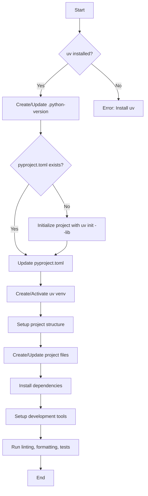

# Dotfiles: Python Virtual Environment Management

This repository contains a set of Zsh functions designed to streamline the process of creating, activating, and managing Python virtual environments. These functions are particularly useful for developers who frequently work with multiple Python projects and need an efficient way to manage their development environments.

## Key Functions

### 1. venv_on

The `venv_on` function is the core of this toolset. It performs the following tasks:

1. Checks if `uv` (a fast Python package installer and resolver) is installed.
2. Creates or updates a `.python-version` file with the Python version "3.13".
3. Initializes the project using `uv init --lib` if `pyproject.toml` doesn't exist.
4. Creates or updates `pyproject.toml` with a custom configuration.
5. Creates and activates a `uv` virtual environment.
6. Sets up a basic project structure with `src/` and `tests/` directories.
7. Creates or updates `__init__.py` and `main.py` files in the project directory.
8. Creates a `README.md` file if it doesn't exist.
9. Installs project dependencies and development dependencies.
10. Creates a `.env` file for environment variables.
11. Updates VSCode settings for the project.
12. Creates a `.gitignore` file with common entries.
13. Runs linting, formatting, and tests using various tools (ruff, pyright, pytest).

### 2. venv_off

This function deactivates the currently active Python virtual environment.

### 3. venv_delete

This function removes the `venv` directory in the current project, effectively deleting the virtual environment.

### 4. update_vscode_settings

This function creates or updates the `.vscode/settings.json` file with predefined settings optimized for Python development in VSCode.

### 5. create_gitignore

This function creates a `.gitignore` file with common entries for Python projects if it doesn't already exist.

### 6. create_readme

This function creates a basic `README.md` file for the project if it doesn't exist.

## Benefits and Convenience

1. **Consistency**: Ensures a consistent setup across all your Python projects.
2. **Time-saving**: Automates the process of setting up a new Python project, saving valuable development time.
3. **Best Practices**: Incorporates best practices for Python development, including virtual environment usage, dependency management, and project structure.
4. **Tool Integration**: Seamlessly integrates popular development tools like ruff, pyright, and pytest.
5. **VSCode Optimization**: Automatically configures VSCode settings for optimal Python development.
6. **Version Control Ready**: Sets up .gitignore and initializes the project for version control.
7. **Environment Isolation**: Ensures each project has its own isolated environment, preventing conflicts between project dependencies.

## Usage

To use these functions, add them to your `.zshrc` file or source them from a separate file. Then, you can use them as follows:

1. To set up and activate a new virtual environment:
   ```
   cd /path/to/your/project
   venv_on
   ```

2. To deactivate the current virtual environment:
   ```
   venv_off
   ```

3. To delete the virtual environment in the current project:
   ```
   venv_delete
   ```

## Workflow Diagram



This set of functions provides a robust and efficient workflow for Python project management, ensuring that each new project starts with a solid foundation and follows best practices in Python development.
