# Cross-Platform Zsh Development Environment

<p align="center">
  
  
  
  
  
</p>

Tired of manually setting up your development environment on every new machine? This repository contains a set of Zsh dotfiles that create a unified, powerful, and automated workflow across **macOS, Linux, and Windows (via WSL)**.

It is built around a modern toolchain that prioritizes speed, consistency, and developer experience. By using the provided functions, you can bootstrap, manage, and work with complex Python, Node.js, and Docker-based projects using simple, memorable commands.

## Key Features

*   **💻 Cross-Platform by Design**: Works seamlessly on macOS, Linux, and WSL with OS-specific adaptations handled automatically.
*   **🚀 Automatic Onboarding**: On a fresh Linux system, the script detects missing tools (`git`, `curl`, `lsd`, `uv`, etc.) and interactively prompts to install them.
*   **🤖 Automated Project Scaffolding**: Create complete, best-practice Python (`python_new_project`) or Node.js (`node_new_project`) projects with a single command.
*   **✨ Seamless Environment Management**:
    *   **`direnv`** for automatic activation/deactivation of Python virtual environments.
    *   **`nvm`** with automatic Node.js version switching via `.nvmrc` files.
*   **🐳 Integrated Docker Helpers**: Functions to quickly start, stop, and manage common development services like PostgreSQL, Qdrant, and Jupyter Lab.
*   **🔒 Private Configuration**: A built-in pattern for managing your secret keys and machine-specific settings in a `.zshrc.private` file, which is kept out of version control.

---

## Prerequisites for Mac

1.  **Homebrew**: Ensure [Homebrew](https://brew.sh/) is installed on your macOS system.
2.  **Core Tools**: Install the key technologies using Homebrew.
    ```bash
    brew install uv direnv pipx jq
    ```
    > **Note:** `jq` is required by the `pipx_check_current_project` helper function.

---

## Installation

Setting up is designed to be as simple as possible.

1.  **Prerequisites**:
    *   Ensure `git` and `zsh` are installed.
    *   Install **[Oh My Zsh](https://ohmy.zsh.sh/#install)**.

3.  **Clone the Repository**:
    ```bash
    git clone https://github.com/your-username/your-repo-name.git ~/.dotfiles
    ```
4.  **Symlink Configuration (optioinal)**: Link the `.zshrc` and `.zsh_functions` files to your home directory.
    ```bash
    # WARNING: This will overwrite existing files. Backup yours first!
    ln -sf ~/dotfiles/zshrc.txt ~/.zshrc
    ln -sf ~/dotfiles/zsh_functions.txt ~/.zsh_functions
    ```
5.  **Enable `direnv`**: The provided `.zshrc` already contains the hook for `direnv`. If you are merging with an existing file, ensure this line is present:
    ```zsh
    # In your .zshrc
    if command -v direnv &> /dev/null; then eval "$(direnv hook zsh)"; fi
    ```
6.  **Restart Your Shell**: Open a new terminal window or run `source ~/.zshrc`.
    *   **On a new Linux VM**, the onboarding script will run automatically and guide you through installing any missing dependencies.
    *   On other systems, a welcome message will confirm the setup is active.

---

## Usage: Your Day-to-Day Python Workflow

### 1. Creating a New Python Project

This is the primary entry point. The function scaffolds everything you need.

```bash
# 1. Create and enter a directory for your new project
mkdir my-awesome-app && cd my-awesome-app

# 2. Run the new project command with the desired Python version
python_new_project 3.12
```
This single command performs over a dozen steps, including `git init`, `uv venv`, `uv pip install`, and creating all necessary config files.

### 2. Setting Up an Existing Project

If you clone a project or need to reset your environment, use `python_setup`. This function intelligently installs default `dev` dependencies and any other optional extras you specify.

```bash
# 1. Clone a repo and enter it
git clone <url> && cd <project-name>

# 2. Set up the environment using a specific Python version
# This will install base + 'dev' dependencies.
python_setup 3.12

# 3. Set up the environment and include additional optional dependencies
# This will install base + 'dev' + 'api' + 'web' dependencies.
python_setup 3.12 api web
```

### 3. Managing a Global Command-Line Tool

If your `pyproject.toml` defines a script, you can install it as a system-wide command using `pipx`. These helpers require an active virtual environment to determine which Python version `pipx` should use.

```bash
# Inside your project directory (with .venv active via direnv):

# Install the tool for the first time with 'cli' extras
pipx_install_current_project cli

# Install with NO extras
pipx_install_current_project --no-extras

# After making changes to your code, reinstall to update the tool
pipx_reinstall_current_project cli

# Check the installation status of the current project's tool
pipx_check_current_project

# Uninstall the tool
pipx_uninstall_current_project
```

### 4. Cleaning Up a Project

To completely remove all generated artifacts and return the directory to a clean state, use `python_delete`. This is non-destructive to your source code.

```bash
# This will remove .venv, .envrc, caches, build artifacts, and uv.lock
python_delete
```
---

## Python Workflow at a Glance

This environment supercharges Python development using `uv`, `direnv`, and `pipx`.

### 1. New Project Scaffolding (`python_new_project`)

```mermaid
graph TD
    subgraph "🚀 Initial Setup"
        A["💻 User runs:<br><b>mkdir my-app && cd my-app</b>"] --> B
        B["💻 User runs:<br><b>python_new_project 3.12</b>"]
    end

    subgraph "🤖 Automated Scaffolding"
        B --> C{"⚙️ `uv init`, `git init`"}
        C --> D["📄 pyproject.toml<br>📄 .gitignore<br>📄 README.md"]
        C --> E["📁 src/my_app/__init__.py<br>📁 tests/test_main.py"]
        C --> F["🐍 `uv venv`<br>Creates .venv"]
        F --> G["📦 `uv pip install -e .[dev]`<br>Installs dependencies"]
        C --> H["🗝️ `direnv`<br>Creates .envrc for auto-activation"]
    end

    subgraph "✅ Result"
        I["✨ A complete, ready-to-develop<br>Python project with one command."]
    end

    D & E & G & H --> I

    classDef userAction fill:#3498db,stroke:#2980b9,stroke-width:2px,color:white;
    classDef automation fill:#f1c40f,stroke:#f39c12,stroke-width:2px,color:black;
    classDef artifact fill:#2ecc71,stroke:#27ae60,stroke-width:2px,color:white;
    classDef result fill:#9b59b6,stroke:#8e44ad,stroke-width:2px,color:white;

    class A,B userAction;
    class C,F,G,H automation;
    class D,E artifact;
    class I result;
```



### 2. Existing Project Setup (`python_setup`)

```mermaid
graph TD
    subgraph "🚀 Initial State"
        A["📁 Existing Project<br>(e.g., after `git clone`)"]
    end

    subgraph "🤖 Automated Setup"
        A --> B["💻 User runs:<br><b>python_setup 3.12 api</b>"]
        B --> C["🗑️ Removes existing `.venv` folder"]
        C --> D["🐍 Creates new `.venv` using<br>the specified Python version (3.12)"]
        D --> E["📦 Installs dependencies from `pyproject.toml`<br>including `[dev]` and specified extras (`[api]`)"]
        E --> F["🗝️ Ensures `.envrc` exists for `direnv`"]
    end

    subgraph "✅ Result"
        G["✨ A clean, consistent, and<br>ready-to-use development environment."]
    end

    F --> G

    classDef userAction fill:#3498db,stroke:#2980b9,stroke-width:2px,color:white;
    classDef automation fill:#e67e22,stroke:#d35400,stroke-width:2px,color:white;
    classDef initialState fill:#95a5a6,stroke:#7f8c8d,stroke-width:2px,color:white;
    classDef result fill:#9b59b6,stroke:#8e44ad,stroke-width:2px,color:white;

    class A initialState;
    class B userAction;
    class C,D,E,F automation;
    class G result;
```



### 3. Global CLI Deployment (`pipx_*`)

```mermaid
graph TD
    subgraph "🔄 Daily Development Cycle"
        A["💻 `cd my-project`"] --> B
        B["✨ `direnv` auto-activates<br>the `.venv` environment"]
        B --> C["👨‍💻 Write code, run `pytest`, `ruff format`..."]
    end

    subgraph "🌍 Global CLI Deployment (Optional)"
        C --> F["Run: `pipx_install_current_project cli`"]
        F --> G["✅ `my-cli` is now available globally"]
        G --> H["... make code changes ..."]
        H --> I["Run: `pipx_reinstall_current_project cli`"]
    end
```



### 4. Daily Development & Deployment

This diagram shows the seamless daily workflow enabled by `direnv` and the `pipx` helper functions.


---

## Node.js & Docker Workflows

### Node.js (`node_*` functions)

The setup provides similar automation for Node.js projects, standardizing on `nvm` and `pnpm`.

*   **Create a new project**: `mkdir my-node-app && cd my-node-app && node_new_project`
    *   This initializes a `package.json`, creates `src/` and `tests/` directories, adds an `.nvmrc` file with your current Node version, and installs Jest, Prettier, and ESLint.
*   **Set up an existing project**: `cd existing-project && node_setup`
    *   This automatically uses the Node version from `.nvmrc` and installs dependencies with `pnpm install`.

### Docker (`docker_*` functions & aliases)

Quickly manage common development services and stacks.

*   **Start a PostgreSQL container for development**: `pg_dev_start`
*   **Start a Qdrant vector database**: `qdrant_start`
*   **Start a full AI/ML stack (Qdrant + Jupyter)**: `dev_stack_start ai`
*   **Check the status of all services**: `dev_stack_status`
*   **Clean up all unused Docker resources**: `dcleanup`

---

## Customization & Private Settings

To keep your main configuration portable and shareable, all personal, private, or machine-specific settings should go into a `~/.zshrc.private` file.

**This file is ignored by Git.**

1.  Create the file: `touch ~/.zshrc.private`
2.  Add your private settings to it.

**Example `~/.zshrc.private`:**
```zsh
# Private and machine-specific settings for this computer.

# Secret API Keys
export OPENAI_API_KEY="sk-xxxxxxxxxxxxxxxxxxxx"
export GITHUB_TOKEN="ghp_xxxxxxxxxxxxxxxxxxxx"

# PATH for a tool installed in a non-standard location on this machine
export PATH="/opt/custom-tool/bin:$PATH"

# A personal alias
alias my-server="ssh my-user@192.168.1.100"
```

---

## File Structure Overview

*   `install.sh`: The script to symlink all configuration files into your home directory.
*   `.zshrc`: The main controller. It detects the OS, loads plugins, and sources all other function files.
*   `.zsh_python_functions`: Contains all Python-related helper functions (`python_new_project`, `pipx_*`, etc.).
*   `.zsh_node_functions`: Contains all Node.js helper functions (`node_new_project`, etc.).
*   `.zsh_docker_functions`: Contains all Docker helper functions and aliases (`pg_dev_start`, `dcleanup`, etc.).
*   `.zsh_linux_onboarding`: The script that runs once on a new Linux machine to install dependencies.
*   `.zsh_mac_welcome`, `.zsh_linux_welcome`, `.zsh_wsl_welcome`: Small scripts that show a status overview when a new shell starts on each respective OS.

---

## Full Function & Alias Reference

### Python Functions

| Function | Arguments | Description |
| :--- | :--- | :--- |
| `python_new_project` | `<py_version>` | Scaffolds a complete new Python project in the current directory. |
| `python_setup` | `<py_version> [extra1...]` | Resets/creates the `.venv` and installs dependencies for an existing project. |
| `python_delete` | `(none)` | Deletes the `.venv`, `.envrc`, caches, and build artifacts. |
| `pipx_install_current_project` | `[extra1...] \| --no-extras` | Installs the current project as a global CLI tool via `pipx`. |
| `pipx_reinstall_current_project` | `[extra1...] \| --no-extras` | Updates the globally installed CLI tool from local source. |
| `pipx_uninstall_current_project` | `(none)` | Uninstalls the `pipx`-managed CLI tool for the current project. |
| `pipx_check_current_project` | `(none)` | Checks if the current project is installed via `pipx`. |

### Node.js Functions

| Function | Arguments | Description |
| :--- | :--- | :--- |
| `node_new_project` | `(none)` | Scaffolds a complete new Node.js project. |
| `node_setup` | `(none)` | Installs dependencies for an existing Node.js project using `.nvmrc` and `pnpm`. |
| `node_clean` | `(none)` | Deletes `node_modules`, build artifacts, and lockfiles. |

### Docker Functions

| Function | Arguments | Description |
| :--- | :--- | :--- |
| `pg_dev_start` | `[db] [pw] [port]` | Starts a PostgreSQL development container. |
| `qdrant_start` | `[port]` | Starts a Qdrant vector database container. |
| `jupyter_start`| `[port] [work_dir]` | Starts a Jupyter Lab container. |
| `dev_stack_start`| `[web\|ai\|full]` | Starts a pre-configured stack of development services. |
| `dev_stack_stop` | `(none)` | Stops all services managed by this script. |
| `dev_stack_status`| `(none)` | Shows the running status of the dev stack services. |
| `dcleanup` | `(none)` | Alias for `docker system prune -af && docker volume prune -f`. |
