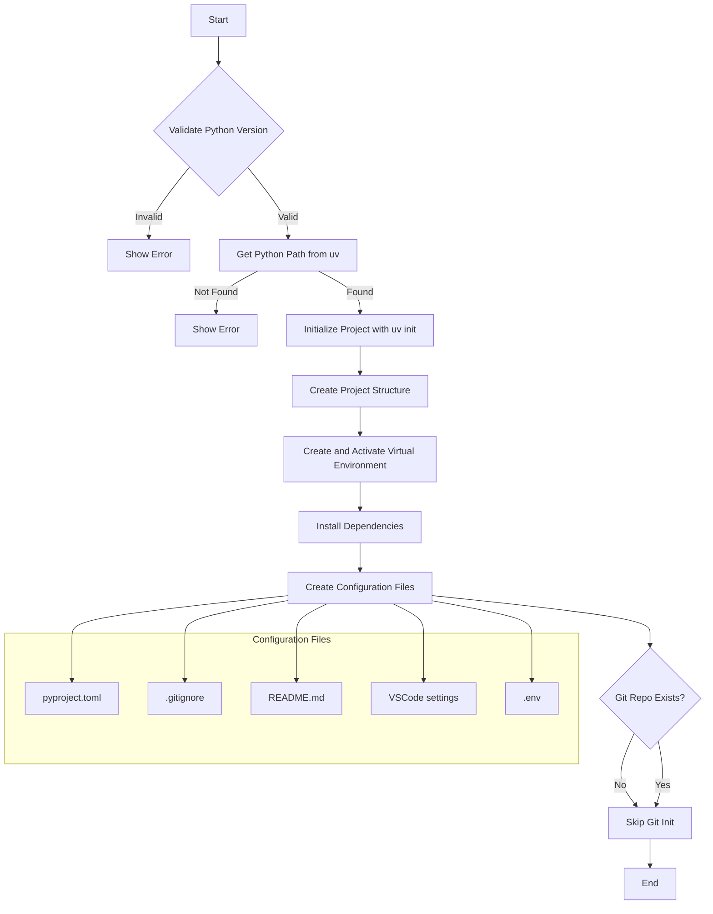
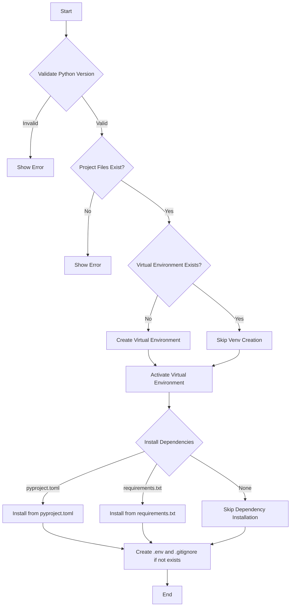

# Dotfiles: Python Development Environment Management

A comprehensive set of Zsh functions for managing Python development environments using `uv`. These tools streamline project creation, setup, and management while enforcing best practices and consistent configurations.

## Core Functions

### 1. get_uv_python_path()

Retrieves the full path to a Python interpreter managed by `uv`.

```bash
get_uv_python_path 3.12
# Output: /Users/admin/.local/share/uv/python/cpython-3.12.7-macos-x86_64-none/bin/python3.12
```

### 2. python_new_project()
Creates a new Python project with complete scaffolding and tooling setup.
```bash
python_new_project 3.12
```



### 3. python_setup()
Sets up an existing Python project with virtual environment and dependencies.



### 4. python_deactivate()
Deactivates the current Python virtual environment.

```bash
python_deactivate
```

### 5. python_delete()
Cleans up Python virtual environment and related files.

```bash
python_delete
```

## Convenient Aliases

#### Project Management

```bash
# New project
py_new, py_new_project, python_new

# Setup existing project
py_setup, py_existing, python_existing

# Deactivate environment
py_off, py_close, py_deactivate

# Cleanup
py_delete, py_clean, py_cleanup
```

#### Python Version Shortcuts

```bash
py313  # Python 3.13
py312  # Python 3.12
py311  # Python 3.11
py310  # Python 3.10
```

## Features & Benefits

#### 1. Automated Setup
- Consistent project structure
- Pre-configured development tools
- VSCode integration
- Git-ready configuration

#### 2. Development Tools
- Ruff for linting and formatting
- Pytest for testing
- Coverage reporting
- Type checking with pyright

#### 3. Best Practices
- Isolated environments
- Dependency management
- Code quality tools
- Version control integration

#### 4. VSCode Integration
- Optimized settings
- Python extension configuration
- Debugging setup
- Linting and formatting

## Project Structure

```code
project_name/
├── .venv/
├── .vscode/
│   └── settings.json
├── src/
│   └── project_name/
│       ├── __init__.py
│       └── main.py
├── tests/
│   ├── __init__.py
│   └── test_main.py
├── .gitignore
├── .env
├── README.md
└── pyproject.toml
```

## Requirements
- Brew
- Zsh shell
- Oh My Zsh
- uv package manager
- Git (recommended)
- VSCode (recommended)

## Usage Examples

#### 1. Creating a New Python Project
```bash
mkdir my_project
cd my_project
python_new_project 3.12
```

#### 2. Setting Up Existing Project
```bash
cd existing_project
python_setup 3.12
```

#### 3. Managing Environment
```bash
# Deactivate environment
python_deactivate

# Clean up project
python_delete
```

