# Dotfiles: An Opinionated Python Development Environment

<p align="center">
  
  
  
  
  
  
</p>

This repository contains a set of dotfiles that create a seamless and highly automated Python development workflow on macOS. It is built around a modern toolchain that prioritizes speed, consistency, and best practices.

The core principle is **convention over configuration**. By using the provided functions and aliases, you can bootstrap, manage, and deploy complex Python projects with single commands, while `uv`, `direnv`, and `pipx` handle the heavy lifting.

## Core Philosophy & Key Technologies

This setup standardizes on a specific set of tools to create a zero-friction experience:

*   **`uv`**: The primary tool for **everything** Python. It's used as a lightning-fast package manager (`pip`), virtual environment manager (`venv`), and command runner.
*   **`direnv`**: Provides **automatic environment activation**. Simply `cd` into a project directory, and your `.venv` is sourced. `cd` out, and it's deactivated. No more `source .venv/bin/activate`.
*   **`pipx`**: The standard for installing Python command-line applications. It installs them into isolated environments, ensuring no dependency conflicts on your system.
*   **`Zsh` + `Oh My Zsh`**: The shell foundation, providing powerful completions, plugins, and the customization framework.
*   **`Homebrew`**: The assumed package manager for installing system-level dependencies on macOS.

---

## The Workflow at a Glance

### 1. New Project Scaffolding

This diagram illustrates the automated steps performed by the `python_new_project` function.

```mermaid
graph TD
    subgraph "🚀 Initial Setup"
        A["💻 User runs:<br><b>mkdir my-app && cd my-app</b>"] --> B
        B["💻 User runs:<br><b>python_new_project 3.12</b>"]
    end

    subgraph "🤖 Automated Scaffolding"
        B --> C{"⚙️ `uv init`, `git init`"}
        C --> D["📄 pyproject.toml<br>📄 .gitignore<br>📄 README.md"]
        C --> E["📁 src/my_app/__init__.py<br>📁 tests/test_main.py"]
        C --> F["🐍 `uv venv`<br>Creates .venv"]
        F --> G["📦 `uv pip install -e .[dev]`<br>Installs dependencies"]
        C --> H["🗝️ `direnv`<br>Creates .envrc for auto-activation"]
    end

    subgraph "✅ Result"
        I["✨ A complete, ready-to-develop<br>Python project with one command."]
    end

    D & E & G & H --> I

    classDef userAction fill:#3498db,stroke:#2980b9,stroke-width:2px,color:white;
    classDef automation fill:#f1c40f,stroke:#f39c12,stroke-width:2px,color:black;
    classDef artifact fill:#2ecc71,stroke:#27ae60,stroke-width:2px,color:white;
    classDef result fill:#9b59b6,stroke:#8e44ad,stroke-width:2px,color:white;

    class A,B userAction;
    class C,F,G,H automation;
    class D,E artifact;
    class I result;
```



### 2. Existing Project Setup

This diagram shows how `python_setup` refreshes an existing project's environment.

```mermaid
graph TD
    subgraph "🚀 Initial State"
        A["📁 Existing Project<br>(e.g., after `git clone`)"]
    end

    subgraph "🤖 Automated Setup"
        A --> B["💻 User runs:<br><b>python_setup 3.12 api</b>"]
        B --> C["🗑️ Removes existing `.venv` folder"]
        C --> D["🐍 Creates new `.venv` using<br>the specified Python version (3.12)"]
        D --> E["📦 Installs dependencies from `pyproject.toml`<br>including `[dev]` and specified extras (`[api]`)"]
        E --> F["🗝️ Ensures `.envrc` exists for `direnv`"]
    end

    subgraph "✅ Result"
        G["✨ A clean, consistent, and<br>ready-to-use development environment."]
    end

    F --> G

    classDef userAction fill:#3498db,stroke:#2980b9,stroke-width:2px,color:white;
    classDef automation fill:#e67e22,stroke:#d35400,stroke-width:2px,color:white;
    classDef initialState fill:#95a5a6,stroke:#7f8c8d,stroke-width:2px,color:white;
    classDef result fill:#9b59b6,stroke:#8e44ad,stroke-width:2px,color:white;

    class A initialState;
    class B userAction;
    class C,D,E,F automation;
    class G result;
```



### 3. Daily Development & Deployment

This diagram shows the seamless daily workflow enabled by `direnv` and the `pipx` helper functions.

```mermaid
graph TD
    subgraph "🔄 Daily Development Cycle"
        A["💻 `cd my-project`"] --> B
        B["✨ `direnv` auto-activates<br>the `.venv` environment"]
        B --> C["👨‍💻 Write code, run `pytest`, `ruff format`..."]
        C --> D["💻 `cd ..`"]
        D --> E["✨ `direnv` auto-deactivates<br>the `.venv` environment"]
    end

    subgraph "🌍 Global CLI Deployment (Optional)"
        C --> F["Run: `pipx_install_current_project cli`<br>to install with 'cli' extra"]
        F --> G["✅ `my-cli` is now available globally"]
        G --> H["... make code changes ..."]
        H --> I["Run: `pipx_reinstall_current_project cli`<br>to update the global command"]
        I --> J["Run: `pipx_uninstall_current_project`<br>to remove the global command"]
    end

    classDef userAction fill:#3498db,stroke:#2980b9,stroke-width:2px,color:white;
    classDef tool fill:#e67e22,stroke:#d35400,stroke-width:2px,color:white;
    classDef devLoop fill:#1abc9c,stroke:#16a085,stroke-width:2px,color:white;
    classDef result fill:#9b59b6,stroke:#8e44ad,stroke-width:2px,color:white;

    class A,D,F,H,I,J userAction;
    class B,E tool;
    class C devLoop;
    class G result;
```



---

## Prerequisites & Installation

1.  **Homebrew**: Ensure [Homebrew](https://brew.sh/) is installed on your macOS system.
2.  **Core Tools**: Install the key technologies using Homebrew.
    ```bash
    brew install uv direnv pipx jq
    ```
    > **Note:** `jq` is required by the `pipx_check_current_project` helper function.

3.  **Clone this Repository**:
    ```bash
    git clone <your-repo-url> ~/dotfiles
    ```
4.  **Symlink Configuration**: Link the `.zshrc` and `.zsh_functions` files to your home directory.
    ```bash
    # WARNING: This will overwrite existing files. Backup yours first!
    ln -sf ~/dotfiles/zshrc.txt ~/.zshrc
    ln -sf ~/dotfiles/zsh_functions.txt ~/.zsh_functions
    ```
5.  **Enable `direnv`**: The provided `.zshrc` already contains the hook for `direnv`. If you are merging with an existing file, ensure this line is present:
    ```zsh
    # In your .zshrc
    if command -v direnv &> /dev/null; then eval "$(direnv hook zsh)"; fi
    ```
6.  **Restart Your Shell**: Open a new terminal window or run `source ~/.zshrc` to apply all changes.

---

## Usage: Your Day-to-Day Workflow

### 1. Creating a New Python Project

This is the primary entry point. The function scaffolds everything you need.

```bash
# 1. Create and enter a directory for your new project
mkdir my-awesome-app && cd my-awesome-app

# 2. Run the new project command with the desired Python version
python_new_project 3.12
```
This single command performs over a dozen steps, including `git init`, `uv venv`, `uv pip install`, and creating all necessary config files.

### 2. Setting Up an Existing Project

If you clone a project or need to reset your environment, use `python_setup`. This function intelligently installs default `dev` dependencies and any other optional extras you specify.

```bash
# 1. Clone a repo and enter it
git clone <url> && cd <project-name>

# 2. Set up the environment using a specific Python version
# This will install base + 'dev' dependencies.
python_setup 3.12

# 3. Set up the environment and include additional optional dependencies
# This will install base + 'dev' + 'api' + 'web' dependencies.
python_setup 3.12 api web
```

### 3. Managing a Global Command-Line Tool

If your `pyproject.toml` defines a script, you can install it as a system-wide command using `pipx`. These helpers require an active virtual environment to determine which Python version `pipx` should use.

```bash
# Inside your project directory (with .venv active via direnv):

# Install the tool for the first time with 'cli' extras
pipx_install_current_project cli

# Install with NO extras
pipx_install_current_project --no-extras

# After making changes to your code, reinstall to update the tool
pipx_reinstall_current_project cli

# Check the installation status of the current project's tool
pipx_check_current_project

# Uninstall the tool
pipx_uninstall_current_project
```

### 4. Cleaning Up a Project

To completely remove all generated artifacts and return the directory to a clean state, use `python_delete`. This is non-destructive to your source code.

```bash
# This will remove .venv, .envrc, caches, build artifacts, and uv.lock
python_delete
```

---

## Generated Project Structure

Running `python_new_project` results in the following structure:

```
project_name/
├── .env              # For local environment variables (in .gitignore)
├── .envrc            # For direnv to automatically activate the virtual environment
├── .gitignore        # A comprehensive gitignore for Python projects
├── .venv/            # The local virtual environment managed by uv
├── .vscode/
│   └── settings.json # Pre-configured VSCode settings for this project
├── README.md         # A template README for your project
├── pyproject.toml    # The heart of your project: metadata, dependencies, and tool configs
├── src/
│   └── project_name/
│       ├── __init__.py # Makes the directory a package (with __version__)
│       └── main.py     # Example entrypoint script
└── tests/
    ├── __init__.py
    └── test_main.py  # Example test file for pytest
```

---

## Full Function & Alias Reference

### Core Project Functions

| Function | Arguments | Description |
| :--- | :--- | :--- |
| `python_new_project` | `<py_version>` | Scaffolds a complete new Python project in the current directory. |
| `python_setup` | `<py_version> [extra1...]` | Resets/creates the `.venv` and installs dependencies for an existing project. |
| `python_delete` | `(none)` | Deletes the `.venv`, `.envrc`, caches, and build artifacts. |
| `pipx_install_current_project` | `[extra1...] \| --no-extras` | Installs the current project as a global CLI tool via `pipx`. |
| `pipx_reinstall_current_project` | `[extra1...] \| --no-extras` | Updates the globally installed CLI tool from local source. |
| `pipx_uninstall_current_project` | `(none)` | Uninstalls the `pipx`-managed CLI tool for the current project. |
| `pipx_check_current_project` | `(none)` | Checks if the current project is installed via `pipx` and shows executables. |

### Utility Aliases & Functions

| Command | Maps To / Description | Example |
| :--- | :--- | :--- |
| `pip` | `uv pip` | `pip install requests` |
| `python` | `python3` | `python --version` |
| `ll` | `lsd -al` | `ll` |
| `py312` | Runs command with Python 3.12 | `py312 myscript.py` |
| `py311` | Runs command with Python 3.11 | `py311 --version` |

