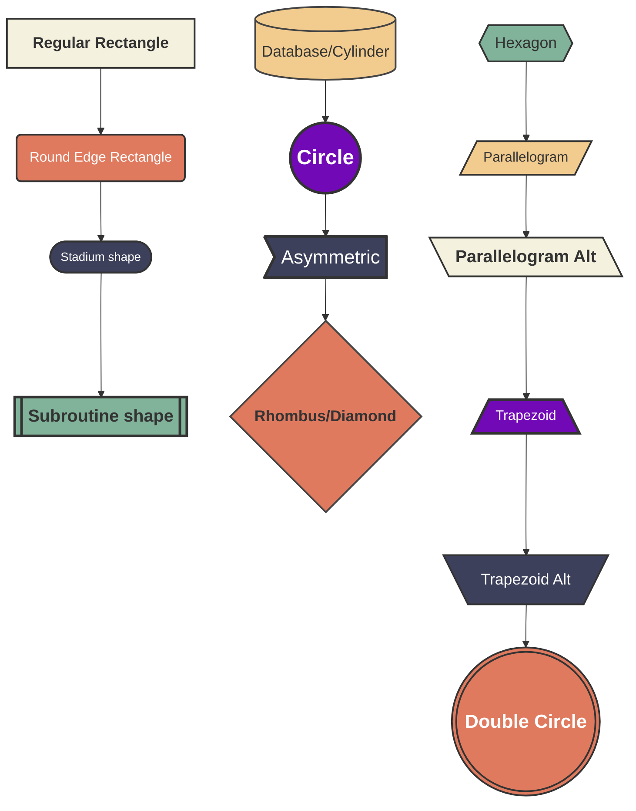
```mermaid
graph TD
    A[Regular Rectangle]
    B(Round Edge Rectangle)
    C([Stadium shape])
    D[[Subroutine shape]]
    E[(Database/Cylinder)]
    F((Circle))
    G>Asymmetric]
    H{Rhombus/Diamond}
    I{{Hexagon}}
    J[/Parallelogram/]
    K[\Parallelogram Alt\]
    L[/Trapezoid\]
    M[\Trapezoid Alt/]
    N(((Double Circle)))

    A --> B
    B --> C
    C --> D

    E --> F
    F --> G
    G --> H

    I --> J
    J --> K
    K --> L
    L --> M
    M --> N


    %% Variation 1 - Additional Styles
    style A fill:#f4f1de,stroke:#333,stroke-width:2px,font-size:18px,font-weight:bold,padding:10px,shadow:2px 2px 5px #000
    style B fill:#e07a5f,stroke:#333,stroke-width:2px,color:#fff,font-size:16px,font-weight:normal,shadow:0px 0px 5px #000
    style C fill:#3d405b,stroke:#333,stroke-width:2px,color:#fff,font-size:14px,font-weight:lighter,padding:15px
    style D fill:#81b29a,stroke:#333,stroke-width:3px,font-size:20px,font-weight:bold,shadow:3px 3px 8px #000
    style E fill:#f2cc8f,stroke:#444,stroke-width:2px,font-size:18px,font-weight:normal,shadow:1px 1px 4px #000
    style F fill:#7209b7,stroke:#333,stroke-width:3px,color:#fff,font-size:24px,font-weight:bold,padding:20px
    style G fill:#3d405b,stroke:#333,stroke-width:3px,color:#fff,font-size:22px,font-weight:lighter,shadow:2px 2px 6px #000
    style H fill:#e07a5f,stroke:#444,stroke-width:2px,font-size:18px,font-weight:bold,padding:5px
    style I fill:#81b29a,stroke:#333,stroke-width:2px,font-size:18px,font-weight:normal,padding:12px
    style J fill:#f2cc8f,stroke:#333,stroke-width:2px,font-size:16px,font-weight:lighter,padding:8px,shadow:1px 1px 5px #000
    style K fill:#f4f1de,stroke:#333,stroke-width:2px,font-size:20px,font-weight:bold
    style L fill:#7209b7,stroke:#333,stroke-width:3px,color:#fff,font-size:16px,font-weight:normal,shadow:2px 2px 4px #000
    style M fill:#3d405b,stroke:#333,stroke-width:2px,color:#fff,font-size:18px,font-weight:lighter,padding:10px
    style N fill:#e07a5f,stroke:#333,stroke-width:2px,color:#fff,font-size:22px,font-weight:bold,shadow:2px 2px 6px #000
```

---

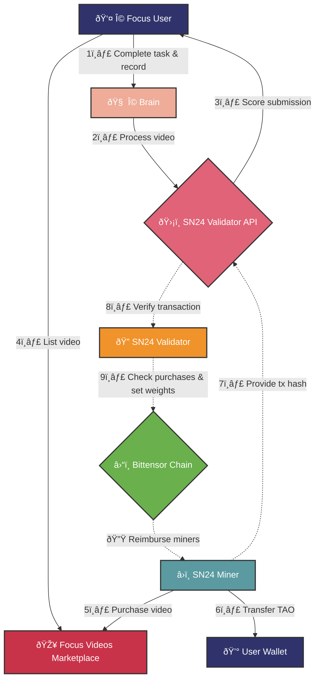
```mermaid
flowchart TD
    A["👤 Ω Focus User"] -->|"1ï¸âƒ£ Complete task & record"| B
    B["🧠 Ω Brain"] -->|"2ï¸âƒ£ Process video"| C
    C{"ðŸ›¡ï¸ SN24 Validator API"}
    C -->|"3ï¸âƒ£ Score submission"| A
    A -->|"4ï¸âƒ£ List video"| E["🎥 Focus Videos Marketplace"]
    F["â›ï¸ SN24 Miner"] -->|"5ï¸âƒ£ Purchase video"| E
    F -->|"6ï¸âƒ£ Transfer TAO"| G["💰 User Wallet"]
    F -.->|"7ï¸âƒ£ Provide tx hash"| C
    C -.->|"8ï¸âƒ£ Verify transaction"| I
    I["🔠SN24 Validator"] -.->|"9ï¸âƒ£ Check purchases & set weights"| H{"â›“ï¸ Bittensor Chain"}
    H -.->|"🔟 Reimburse miners"| F

    classDef user fill:#30336b,stroke:#333,stroke-width:2px,color:white;
    classDef brain fill:#eeac99,stroke:#333,stroke-width:2px,color:white;
    classDef api fill:#e06377,stroke:#333,stroke-width:2px,color:white;
    classDef market fill:#c83349,stroke:#333,stroke-width:2px,color:white;
    classDef miner fill:#5b9aa0,stroke:#333,stroke-width:2px,color:white;
    classDef validator fill:#f0932b,stroke:#333,stroke-width:2px,color:white;
    classDef chain fill:#6ab04c,stroke:#333,stroke-width:2px,color:white;
    classDef external fill:#61c0bf,stroke:#333,stroke-width:2px,color:white;

    class A user;
    class B brain;
    class C api;
    class D,E market;
    class F miner;
    class G user;
    class H chain;
    class I validator;
    class J external;
```

---

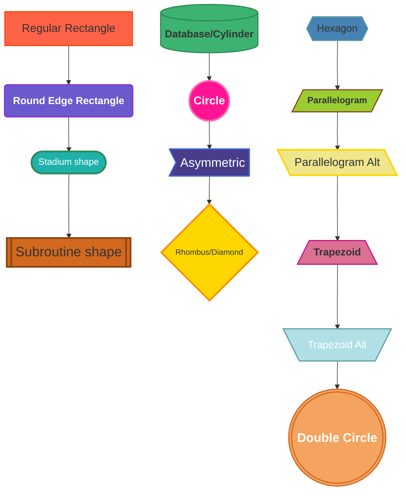
```mermaid
graph TD
    A[Regular Rectangle]
    B(Round Edge Rectangle)
    C([Stadium shape])
    D[[Subroutine shape]]
    E[(Database/Cylinder)]
    F((Circle))
    G>Asymmetric]
    H{Rhombus/Diamond}
    I{{Hexagon}}
    J[/Parallelogram/]
    K[\Parallelogram Alt\]
    L[/Trapezoid\]
    M[\Trapezoid Alt/]
    N(((Double Circle)))

    A --> B
    B --> C
    C --> D

    E --> F
    F --> G
    G --> H

    I --> J
    J --> K
    K --> L
    L --> M
    M --> N


    %% Variation 2 - Even more styling
    style A fill:#ff6347,stroke:#ff4500,stroke-width:2px,font-size:20px,font-weight:normal,text-align:center,padding:15px,shadow:4px 4px 10px #000
    style B fill:#6a5acd,stroke:#8a2be2,stroke-width:2px,color:#fff,font-size:18px,font-weight:bold,text-align:center,padding:10px
    style C fill:#20b2aa,stroke:#2e8b57,stroke-width:3px,color:#fff,font-size:16px,font-weight:lighter,shadow:2px 2px 8px #000
    style D fill:#d2691e,stroke:#8b4513,stroke-width:3px,font-size:24px,font-weight:normal,text-align:center,padding:20px
    style E fill:#3cb371,stroke:#2e8b57,stroke-width:2px,font-size:18px,font-weight:bold,shadow:3px 3px 10px #000
    style F fill:#ff1493,stroke:#ff69b4,stroke-width:3px,color:#fff,font-size:20px,font-weight:bold,text-align:center,padding:25px
    style G fill:#483d8b,stroke:#4169e1,stroke-width:2px,color:#fff,font-size:22px,font-weight:lighter,padding:10px
    style H fill:#ffd700,stroke:#ff8c00,stroke-width:3px,font-size:14px,font-weight:normal,text-align:left,padding:5px
    style I fill:#4682b4,stroke:#5f9ea0,stroke-width:2px,font-size:18px,font-weight:lighter,padding:12px
    style J fill:#9acd32,stroke:#8b4513,stroke-width:2px,font-size:16px,font-weight:bold,padding:8px,shadow:1px 1px 5px #000
    style K fill:#f0e68c,stroke:#ffd700,stroke-width:3px,font-size:20px,font-weight:normal,text-align:center,padding:12px
    style L fill:#db7093,stroke:#c71585,stroke-width:2px,font-size:18px,font-weight:bold,shadow:2px 2px 4px #000
    style M fill:#b0e0e6,stroke:#5f9ea0,stroke-width:2px,color:#fff,font-size:18px,font-weight:lighter,padding:10px
    style N fill:#f4a460,stroke:#d2691e,stroke-width:2px,color:#fff,font-size:22px,font-weight:bold,shadow:2px 2px 6px #000
```

---

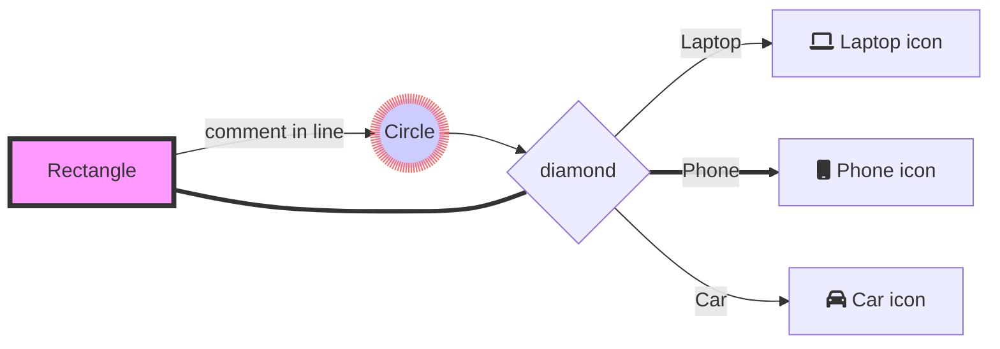
```mermaid
graph LR
   id1[Rectangle] -->|comment in line| id2((Circle))
   id2 --> C{diamond}
   C -->|Laptop| D[fa:fa-laptop Laptop icon]
   C ==>|Phone| E[fa:fa-mobile Phone icon]
   C -->|Car| F[fa:fa-car Car icon]
   id1===C


    style id1 fill:#f9f,stroke:#333,stroke-width:4px
    style id2 fill:#ccf,stroke:#f66,stroke-width:8px,stroke-dasharray: 1, 10
```

---

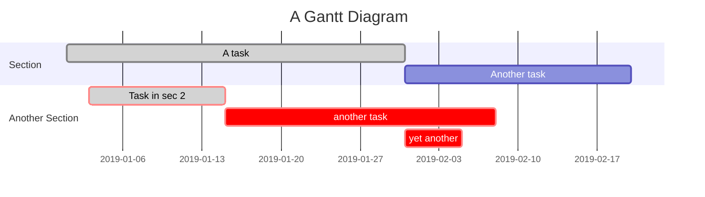
```mermaid
gantt
    title A Gantt Diagram
    dateFormat  YYYY-MM-DD
    section Section
    A task           : done, a1, 2019-01-01, 30d
    Another task     :after a1  , 20d

    section Another Section
    Task in sec  2     : crit, done, s1, 2019-01-03,12d
    another task      :crit, s2, after s1,  24d
    yet another :crit, after a1, 5d
```

---

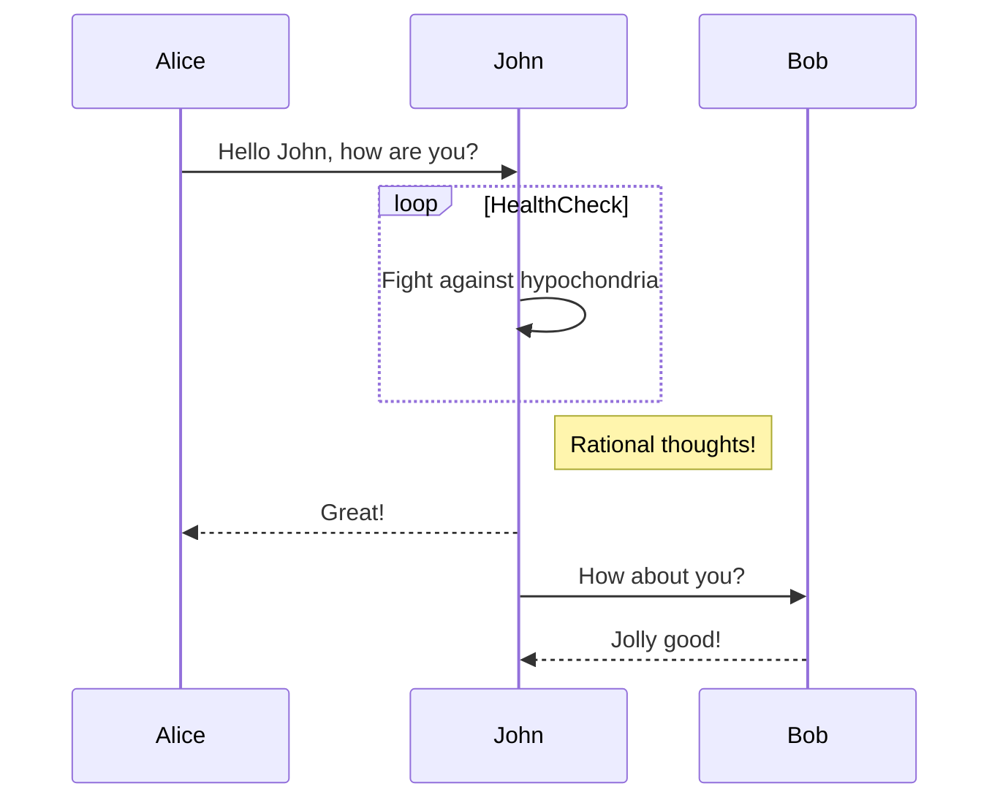
```mermaid
sequenceDiagram
Alice->>John: Hello John, how are you?
loop HealthCheck
    John->>John: Fight against hypochondria
end
Note right of John: Rational thoughts!
John-->>Alice: Great!
John->>Bob: How about you?
Bob-->>John: Jolly good!
```

---

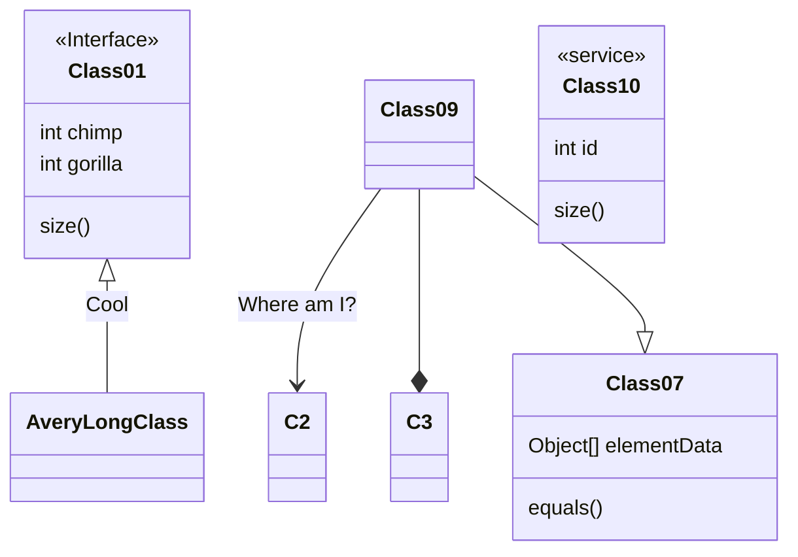
```mermaid
classDiagram
Class01 <|-- AveryLongClass : Cool
<<Interface>> Class01
Class09 --> C2 : Where am I?
Class09 --* C3
Class09 --|> Class07
Class07 : equals()
Class07 : Object[] elementData
Class01 : size()
Class01 : int chimp
Class01 : int gorilla
class Class10 {
  <<service>>
  int id
  size()
}
```

---

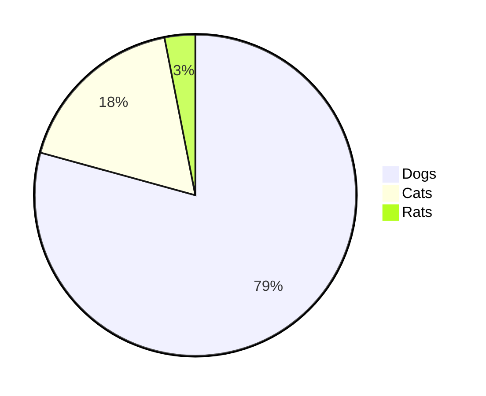
```mermaid
pie
"Dogs" : 386
"Cats" : 85.9
"Rats" : 15
```

---

A C4 diagram

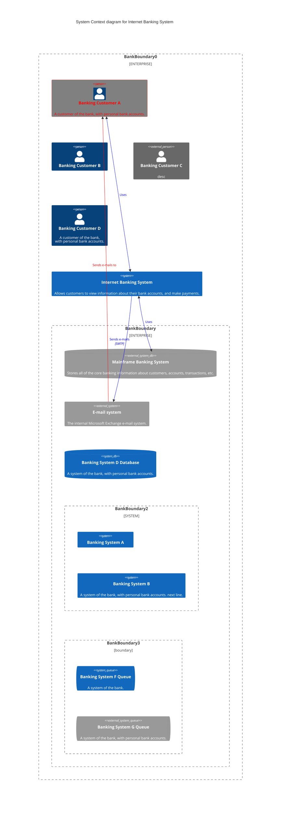
```mermaid
C4Context
      title System Context diagram for Internet Banking System
      Enterprise_Boundary(b0, "BankBoundary0") {
        Person(customerA, "Banking Customer A", "A customer of the bank, with personal bank accounts.")
        Person(customerB, "Banking Customer B")
        Person_Ext(customerC, "Banking Customer C", "desc")

        Person(customerD, "Banking Customer D", "A customer of the bank, <br/> with personal bank accounts.")

        System(SystemAA, "Internet Banking System", "Allows customers to view information about their bank accounts, and make payments.")

        Enterprise_Boundary(b1, "BankBoundary") {

          SystemDb_Ext(SystemE, "Mainframe Banking System", "Stores all of the core banking information about customers, accounts, transactions, etc.")

          System_Boundary(b2, "BankBoundary2") {
            System(SystemA, "Banking System A")
            System(SystemB, "Banking System B", "A system of the bank, with personal bank accounts. next line.")
          }

          System_Ext(SystemC, "E-mail system", "The internal Microsoft Exchange e-mail system.")
          SystemDb(SystemD, "Banking System D Database", "A system of the bank, with personal bank accounts.")

          Boundary(b3, "BankBoundary3", "boundary") {
            SystemQueue(SystemF, "Banking System F Queue", "A system of the bank.")
            SystemQueue_Ext(SystemG, "Banking System G Queue", "A system of the bank, with personal bank accounts.")
          }
        }
      }

      BiRel(customerA, SystemAA, "Uses")
      BiRel(SystemAA, SystemE, "Uses")
      Rel(SystemAA, SystemC, "Sends e-mails", "SMTP")
      Rel(SystemC, customerA, "Sends e-mails to")

      UpdateElementStyle(customerA, $fontColor="red", $bgColor="grey", $borderColor="red")
      UpdateRelStyle(customerA, SystemAA, $textColor="blue", $lineColor="blue", $offsetX="5")
      UpdateRelStyle(SystemAA, SystemE, $textColor="blue", $lineColor="blue", $offsetY="-10")
      UpdateRelStyle(SystemAA, SystemC, $textColor="blue", $lineColor="blue", $offsetY="-40", $offsetX="-50")
      UpdateRelStyle(SystemC, customerA, $textColor="red", $lineColor="red", $offsetX="-50", $offsetY="20")

      UpdateLayoutConfig($c4ShapeInRow="3", $c4BoundaryInRow="1")
```

---

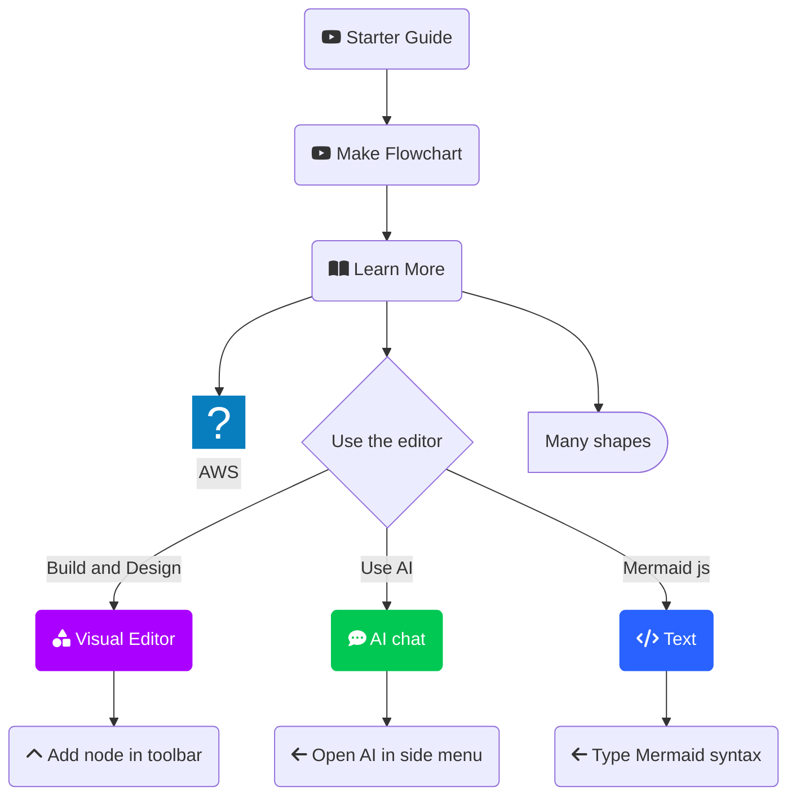
```mermaid
flowchart TD
    %% Nodes
    A("fab:fa-youtube Starter Guide") --> B("fab:fa-youtube Make Flowchart")
    B --> C("fa:fa-book-open Learn More")
    C --> n1["AWS"] & D{"Use the editor"} & n2["Many shapes"]
    D -- Build and Design --> E("fa:fa-shapes Visual Editor")
    E --> F("fa:fa-chevron-up Add node in toolbar")
    D -- Use AI --> G("fa:fa-comment-dots AI chat")
    G --> H("fa:fa-arrow-left Open AI in side menu")
    D -- Mermaid js --> I("fa:fa-code Text")
    I --> J("fa:fa-arrow-left Type Mermaid syntax")

    %% Individual node styling. Try the visual editor toolbar for easier styling!
    n1@{ icon: "fa:user", pos: "b", h: 24}
    n2@{ shape: delay}
    style E color:#FFFFFF, fill:#AA00FF, stroke:#AA00FF
    style G color:#FFFFFF, stroke:#00C853, fill:#00C853
    style I color:#FFFFFF, stroke:#2962FF, fill:#2962FF
```

---

A simple block diagram with arrow down

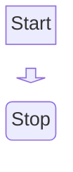
```mermaid
block-beta
      columns 1
      A["Start"]
      down<[" "]>(down)
      C("Stop")
```

---

A simple block diagram with column widths set

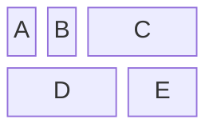
```mermaid
block-beta
      columns 5
      A B C:3
      D:3 E:2
```

---

A sample architecture diagram

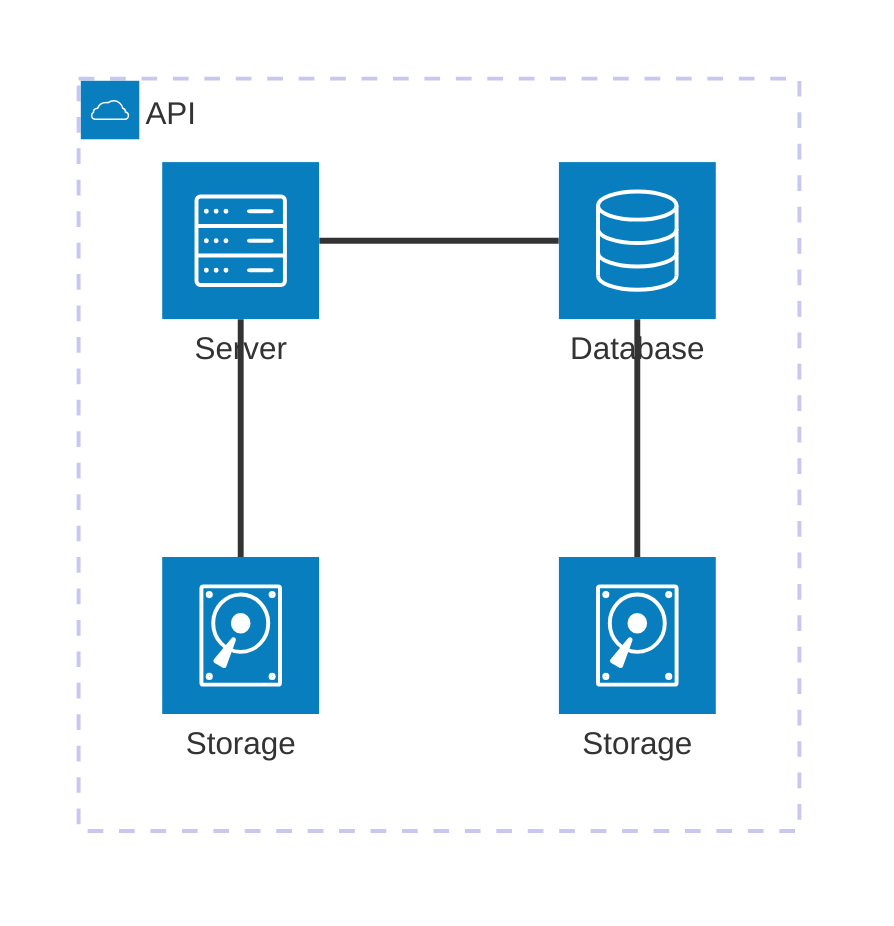
```mermaid
architecture-beta
    group api(cloud)[API]

    service db(database)[Database] in api
    service disk1(disk)[Storage] in api
    service disk2(disk)[Storage] in api
    service server(server)[Server] in api

    db:L -- R:server
    disk1:T -- B:server
    disk2:T -- B:db
```

---

A sample block diagram

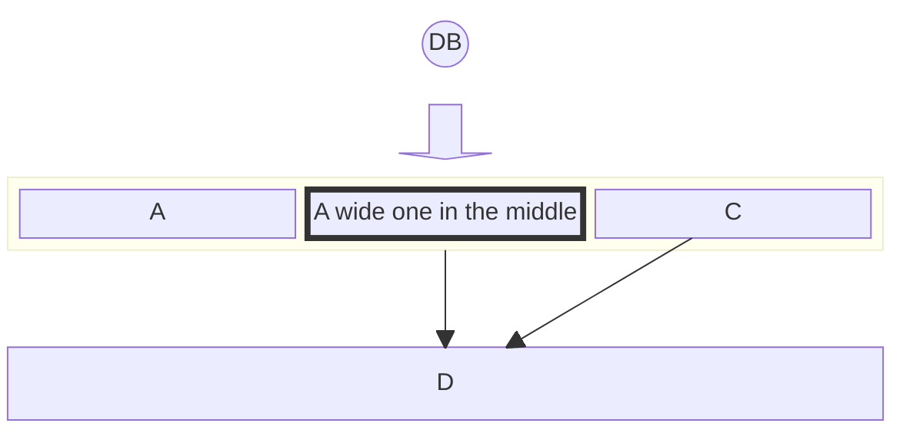
```mermaid
block-beta
      columns 1
        db(("DB"))
        blockArrowId6<["&nbsp;&nbsp;&nbsp;"]>(down)
        block:ID
          A
          B["A wide one in the middle"]
          C
        end
        space
        D
        ID --> D
        C --> D
        style B fill:#d6dAdding,stroke:#333,stroke-width:4px
```

---

A class sequence diagram with inheritance

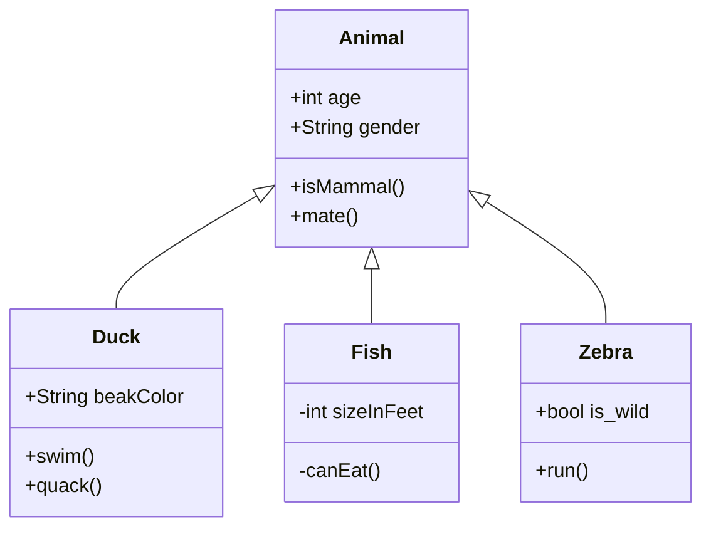
```mermaid
classDiagram
    Animal <|-- Duck
    Animal <|-- Fish
    Animal <|-- Zebra
    Animal : +int age
    Animal : +String gender
    Animal: +isMammal()
    Animal: +mate()
    class Duck{
      +String beakColor
      +swim()
      +quack()
    }
    class Fish{
      -int sizeInFeet
      -canEat()
    }
    class Zebra{
      +bool is_wild
      +run()
    }
```

---

A class diagram using cardinalities

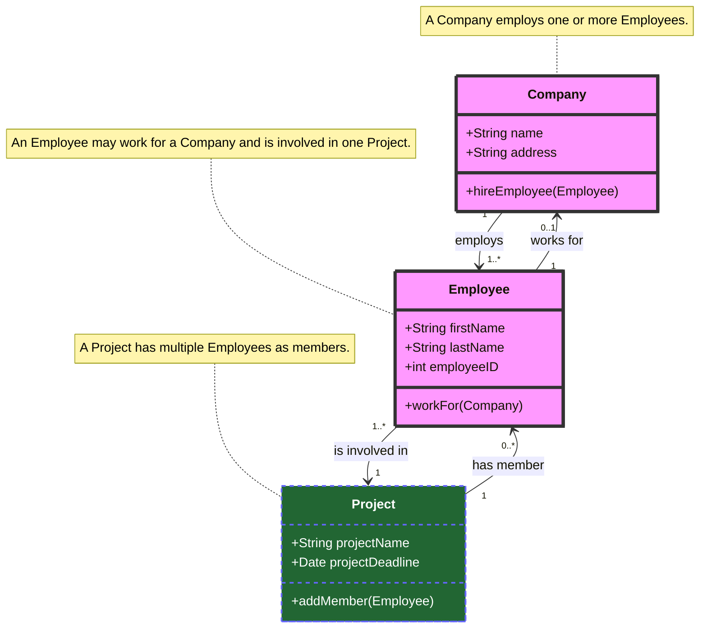
```mermaid
classDiagram
    %% Example showing the use of cardinalities

    %% Defining the classes
    class Company {
        +String name
        +String address
        +hireEmployee(Employee)
    }
    class Employee {
        +String firstName
        +String lastName
        +int employeeID
        +workFor(Company)
    }
    class Project {
        +String projectName
        +Date projectDeadline
        +addMember(Employee)
    }

    %% Defining the relationships with cardinalities
    Company "1" --> "1..*" Employee : employs
    Employee "1" --> "0..1" Company : works for
    Employee "1..*" --> "1" Project : is involved in
    Project "1" --> "0..*" Employee : has member

    %% Adding a note to explain the diagram
    note for Company "A Company employs one or more Employees."
    note for Employee "An Employee may work for a Company and is involved in one Project."
    note for Project "A Project has multiple Employees as members."

    %% Applying CSS classes using shorthand notation
    class Company:::companyStyle
    class Employee:::employeeStyle
    class Project:::projectStyle

    %% Apply CSS classes using cssClass statement
    %% cssClass "Company, Employee, Project" generalClass

     style Company fill:#f9f,stroke:#333,stroke-width:4px
     style Employee fill:#f9f,stroke:#333,stroke-width:4px
     style Project fill:#263,stroke:#66f,stroke-width:2px,color:#fff,stroke-dasharray: 5 5
```

---

Class schema for an issue tracking system with inheritance and interfaces

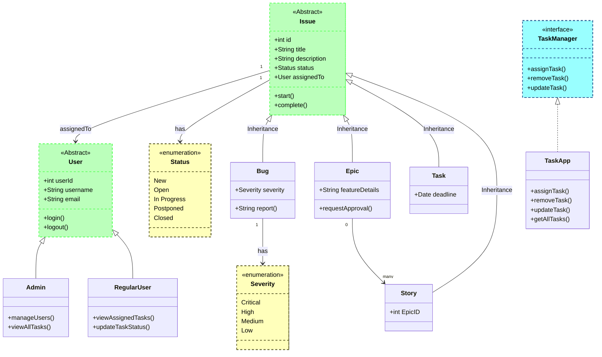
```mermaid
classDiagram
    class Issue {
        <<Abstract>>
        +int id
        +String title
        +String description
        +Status status
        +User assignedTo
        +start()
        +complete()
    }

    class Bug {
        +Severity severity
        +String report()
    }

    class Epic {
        +String featureDetails
        +requestApproval()
    }

    class Story {
        +int EpicID
    }

    class Task {
        +Date deadline
    }

    class User {
        <<Abstract>>
        +int userId
        +String username
        +String email
        +login()
        +logout()
    }

    class Admin {
        +manageUsers()
        +viewAllTasks()
    }

    class RegularUser {
        +viewAssignedTasks()
        +updateTaskStatus()
    }

    class TaskManager {
        <<interface>>
        +assignTask()
        +removeTask()
        +updateTask()
    }
    TaskManager <|.. TaskApp

    class TaskApp {
        +assignTask()
        +removeTask()
        +updateTask()
        +getAllTasks()
    }

    class Status {
        <<enumeration>>
        New
        Open
        In Progress
        Postponed
        Closed
    }

    class Severity {
        <<enumeration>>
        Critical
        High
        Medium
        Low
    }

    Issue "1" -->  User : assignedTo
    Issue "1" --> Status : has
    Bug "1" --> Severity : has
    Issue <|-- Bug : Inheritance
    Issue <|-- Epic : Inheritance
    Issue <|-- Task : Inheritance
    Issue <|-- Story : Inheritance
    Epic "0" --> "many" Story
    User <|-- Admin
    User <|-- RegularUser

    style Issue fill:#bfb,stroke:#6f6,stroke-width:2px,color:#000,stroke-dasharray: 5 5
    style User fill:#bfb,stroke:#6f6,stroke-width:2px,color:#000,stroke-dasharray: 5 5
    style TaskManager fill:#9ff,stroke:#369,stroke-width:2px,color:#000,stroke-dasharray: 5 5
    style Status fill:#ffb,stroke:#663,stroke-width:2px,color:#000,stroke-dasharray: 5 5
    style Severity fill:#ffb,stroke:#663,stroke-width:2px,color:#000,stroke-dasharray: 5 5
```

---

An entity relationship diagram

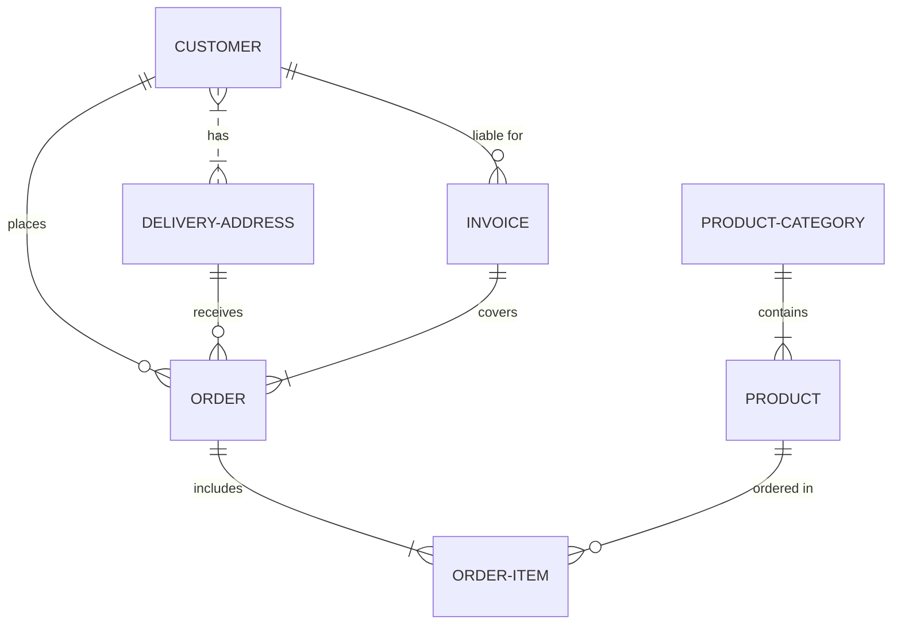
```mermaid
erDiagram
    CUSTOMER }|..|{ DELIVERY-ADDRESS : has
    CUSTOMER ||--o{ ORDER : places
    CUSTOMER ||--o{ INVOICE : "liable for"
    DELIVERY-ADDRESS ||--o{ ORDER : receives
    INVOICE ||--|{ ORDER : covers
    ORDER ||--|{ ORDER-ITEM : includes
    PRODUCT-CATEGORY ||--|{ PRODUCT : contains
    PRODUCT ||--o{ ORDER-ITEM : "ordered in"
```

---

A flowchart with an icon

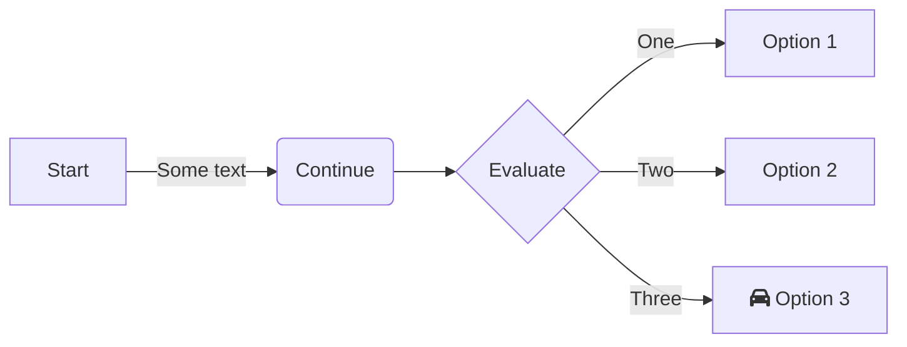
```mermaid
flowchart LR
  A[Start] --Some text--> B(Continue)
  B --> C{Evaluate}
  C -- One --> D[Option 1]
  C -- Two --> E[Option 2]
  C -- Three --> F[fa:fa-car Option 3]
```

---

A simple flowchart showing bug ticketing process

```mermaid
flowchart LR
  classDef redNode fill:#D50000,color:#000000;
  classDef pinkNode fill:#E1BEE7,color:#000000;
  classDef yellowNode fill:#FFF9C4,color:#000000;
  classDef blackNode fill:#000000,stroke:#FFD600,stroke-width:4px,stroke-dasharray: 0,color:#FFFFFF;
  classDef greenNode fill:#00F840,color:#000000;
  classDef reminderNode stroke:#FFD600,stroke-width:4px,stroke-dasharray: 0,fill:#000000,color:#FFFFFF;
  classDef blueSubgraph fill:#BBDEFB;

  subgraph subgraph_zv2q8ucnp["Shape descriptions"]
      customer((Customer)):::redNode
      Support["Support"]:::pinkNode
      Technician{{Technician}}:::yellowNode
      Decision{"Decision"}:::blackNode
  end

  A((Reported issue)):::redNode --> B["Ticket is created"]
  B --> C{"Working hours?"}:::blackNode
  C -- Yes --> E{{"Tickets are sent to day team for response"}}:::yellowNode
  C -- No --> F["Tickets are sent to on-call staff for response"]:::pinkNode
  E --> Worked{"Ticket being worked on?"}:::reminderNode
  F --> Worked
  Worked -- Yes --> G["Work on the tickets based on priority"]:::pinkNode
  Worked -- No --> Reminder["Reminder is sent"]
  Reminder --> Worked
  G --> H["Team fixes the issue"]:::pinkNode
  H --> I{"Is the issue resolved?"}:::reminderNode
  I -- Yes --> Done["Ticket is closed and follow-up email is sent"]:::greenNode
  I -- No --> H

  class subgraph_zv2q8ucnp blueSubgraph

  linkStyle 2 stroke:#00C853,fill:none
  linkStyle 3 stroke:#D50000,fill:none
  linkStyle 6 stroke:#00C853,fill:none
  linkStyle 7 stroke:#D50000,fill:none
  linkStyle 11 stroke:#00C853,fill:none
  linkStyle 12 stroke:#D50000,fill:none
```

---

A simple project planning flowchart

```mermaid
flowchart TD
%% Nodes
A("Project Idea"):::green
B("Initial Planning"):::orange
C("Detailed Design <br> & <br> Requirements"):::blue
D{"Decision: Continue or Stop?"}:::yellow
E("Development Phase"):::pink
F("Testing Phase"):::purple
G("Deployment"):::green
H("Feedback and Improvement"):::orange

%% Edges
A --> B --> C --> D
D -- Continue --> E --> F --> G
D -- Stop --> H
G --> H
H --> B

%% Styling
classDef green fill:#B2DFDB,stroke:#00897B,stroke-width:2px;
classDef orange fill:#FFE0B2,stroke:#FB8C00,stroke-width:2px;
classDef blue fill:#BBDEFB,stroke:#1976D2,stroke-width:2px;
classDef yellow fill:#FFF9C4,stroke:#FBC02D,stroke-width:2px;
classDef pink fill:#F8BBD0,stroke:#C2185B,stroke-width:2px;
classDef purple fill:#E1BEE7,stroke:#8E24AA,stroke-width:2px;
```

---

A simple, clean flowchart showing the carbon cycle

```mermaid
flowchart TB
  A("CO2 cycle") --> B("Photosynthesis")
  B --> E("Organic carbon") & n3("Decay organism")
  n1("Sunlight") --> B
  n3 --> nb("Dead organisms and waste product")
  nb --> n5("Root respiration") & ng("Fossil fuels")
  n5 --> nl("Factory emission")
  nl --> A
  nn("Animal respiration") --> A
  style A stroke:#000000,fill:#E1F0D4
  style B stroke:#000000,fill:#C3EFE0
  style E stroke:#000000,fill:#F6ACD8
  style n3 stroke:#000000,fill:#C2C4B3
  style n1 stroke:#000000,fill:#F2F7D2
  style nb stroke:#000000,fill:#E9A3B2
  style n5 stroke:#000000,fill:#DBCDF8
  style ng stroke:#000000,fill:#BEF6AC
  style nl stroke:#000000,fill:#A3E9CC
  style nn stroke:#000000,fill:#D4EFF0
```

---

Large flowchart showing the brewing process, using elk renderer

```mermaid
flowchart-elk
  A{"What type
    of beer
    do you want
    to brew?"} --> na["Lager"] & nk["Belgian"] & np["Stout"] & nd["IPA"]
  na --> n8["Hops:
  Saaz,
  Tettnanger,
  Spalter,
  Hallertauer Mittelfrüh"] & nu["Malt:
  Lager Malt"]
  nk --> ns["Hops:
  Saaz,
  Hallertau,
  Tettnang,
  Styrian Goldings"] & n9["Malt:
  Pilsen 6RH"] & nq["Extras:
  Fruit puree,
  Caramel Sugar
  Anything you like"]
  np --> nf["Hops:
  Saaz,
  Fuggle"] & nl["Malt:
  Pale Ale,
  Dark malt,
  Chocolate Malt"]
  nd --> n0["Hops:
  Citra,
  Mosaic,
  Simcoe,
  Amarillo"] & nv["Malt:
  Maris Otter,
  2-row,
  Ale malt"]
  nl --> no["Time to start brewing!"]
  nf --> no
  n0 --> no
  nv --> no
  nq --> no
  n9 --> no
  ns --> no
  nu --> no
  n8 --> no
  nc["So you decided to brew a beer? Great!"] --> nb["Take stock of your equipment"]
  nb --> ni["Do you have everything you need?"]
  ni --> n3["What are you missing?"]
  n3 -- Carbonation sugar --> n7["You can skip that for
   now but make sure to order it,
   you'll need it in a few weeks"]
  n3 -- Bottle Caps --> n7
  n3 -- Bottles --> n7
  n3 -- Sanitizing agent --> nw["Buy it now"]
  n3 -- A large pot --> nw
  n7 --> A
  n3 -- Thermometer --> nw
  ni -- Yes --> A
  n3 -- Fermentation Vessel --> nw
  nw --> A
  no --> nr["Mashing"]
  nr --> n5["Wort Boiling"] & nx["Add water to the pot
  and heat to the desired
  temperature + 3-4 degrees"]
  n5 --> n1["Fermentation"] & ny["Bring the wort to a boil"]
  n1 --> n4["Tapping"] & nj["Add the cooled wort
  to your fermentation vessel"]
  nx --> nh["Place the malt in a bag and
  soak    for 60 minutes"]
  nh --> ng["Place the bag with
  mash in a sieve over the pot"]
  ng --> n68q["Pour heated water through
  the mash into the pot until
  the desired quantity of
  liquid is in the pot"]
  n68q --> n5
  ny --> n2["Add 13g of hops
  after 15 minutes"]
  n2 --> n6["Boil for 30 minutes
  and then add 13g of hops"]
  n6 --> nt["Boil for ten minutes
  and add 13g of hops"]
  nt --> ne["Boil for five minutes
  and add the pot to a
  large container of
  iced water to cool"]
  ne --> n1
  nj --> nn["Let ferment for 14 days"]
  nn --> n4
  n4 --> nz["Add beer and 3g of
  sugar to the desired
  quantity of bottles"]
  nz --> nc0f["Carbonate for 14 days"]
  nc0f --> nc3d["Cool and Enjoy"]
  style na stroke:#00C853,fill:#C8E6C9
  style nk stroke:#FFD600,fill:#FFF9C4
  style np stroke:#FFD600,fill:#FFF9C4
  style nd stroke:#FFD600,fill:#FFF9C4
  style n8 stroke:#00C853,fill:#C8E6C9
  style nu stroke:#00C853,fill:#C8E6C9
  style ns stroke:#FFD600,fill:#FFF9C4
  style n9 stroke:#FFD600,fill:#FFF9C4
  style nq stroke:#FFD600,fill:#FFF9C4
  style nf stroke:#FFD600,fill:#FFF9C4
  style nl fill:#FFF9C4,stroke:#FFD600
  style n0 stroke:#FFD600,fill:#FFF9C4
  style nv stroke:#FFD600,fill:#FFF9C4
  style no stroke:#00C853,fill:#C8E6C9
  style nr fill:#E1BEE7
  style n5 fill:#BBDEFB
  style nx fill:#E1BEE7
  style n1 fill:#FFE0B2
  style ny fill:#BBDEFB
  style n4 fill:#FFF9C4
  style nj fill:#FFE0B2
  style nh fill:#E1BEE7
  style ng fill:#E1BEE7
  style n68q fill:#E1BEE7
  style n2 fill:#BBDEFB
  style n6 fill:#BBDEFB
  style nt fill:#BBDEFB
  style ne fill:#BBDEFB
  style nn fill:#FFE0B2
  style nz fill:#FFF9C4
  style nc0f stroke:#BBDEFB,fill:#FFF9C4
  style nc3d fill:#C8E6C9
```

---

An flowchart with multiple decision points and color formatting

```mermaid
flowchart TD
  A(("You have decided to play a game tonight")) --> n8(["Great!!!"])
  ny{{"Are you going to play alone?"}} -- Yes --> nq{{"Singleplayer games"}}
  n8 --> np("Start your computer")
  np --> ny
  n7("Are your friends online?") -- Yes --> nw("Do they wanna play?")
  nq --> nc{{"Time to pick the game"}}
  n7 -- No --> nq
  nw -- No --> nq
  nw -- Yes --> n2("time to pick the game")
  n2 --> n1("World of Warcraft") & n9("StarCraft") & nj("League of legends") & ns("DOTA 2") & nu("Minecraft")
  nc --> ni{{"DOOM"}} & nk{{"Baldurs Gate 3"}} & nb{{"Fallout new vegas"}} & n0{{"Witcher"}} & nl{{"Sims"}}
  nl --> nf[["Now that you have picked a game"]]
  n0 --> nf
  nb --> nf
  nk --> nf
  ni --> nf
  n1 --> no[["Now that you have picked a game"]]
  n9 --> no
  nj --> no
  ns --> no
  nu --> no
  nf --> nd{"Great have fun!"}
  no --> nd
  ny -- No --> n7
  np --> n7
  style A fill:#C8E6C9,stroke-width:4px,stroke-dasharray: 0,stroke:#00C853
  style n8 stroke-width:4px,stroke-dasharray: 0,fill:#C8E6C9,stroke:#00C853
  style ny stroke-width:4px,stroke-dasharray: 0,stroke:#FF6D00,fill:#FFE0B2
  style nq stroke-width:4px,stroke-dasharray: 0,stroke:#FF6D00,fill:#FFE0B2
  style np stroke:#00C853,stroke-width:4px,stroke-dasharray: 0
  style n7 stroke-width:4px,stroke-dasharray: 0,fill:#BBDEFB,stroke:#2962FF
  style nw stroke-width:4px,stroke-dasharray: 0,stroke:#2962FF,fill:#BBDEFB
  style nc stroke-width:4px,stroke-dasharray: 0,stroke:#FF6D00,fill:#FFE0B2
  style n2 stroke-width:4px,stroke-dasharray: 0,fill:#BBDEFB,stroke:#2962FF
  style n1 stroke-width:4px,stroke-dasharray: 0,fill:#BBDEFB,stroke:#2962FF
  style n9 stroke-width:4px,stroke-dasharray: 0,fill:#BBDEFB,stroke:#2962FF
  style nj stroke-width:4px,stroke-dasharray: 0,fill:#BBDEFB,stroke:#2962FF
  style ns stroke-width:4px,stroke-dasharray: 0,fill:#BBDEFB,stroke:#2962FF
  style nu stroke-width:4px,stroke-dasharray: 0,fill:#BBDEFB,stroke:#2962FF
  style ni stroke-width:4px,stroke-dasharray: 0,fill:#FFE0B2,stroke:#FF6D00
  style nk stroke-width:4px,stroke-dasharray: 0,stroke:#FF6D00,fill:#FFE0B2
  style nb stroke-width:4px,stroke-dasharray: 0,stroke:#FF6D00,fill:#FFE0B2
  style n0 stroke-width:4px,stroke-dasharray: 0,stroke:#FF6D00,fill:#FFE0B2
  style nl stroke-width:4px,stroke-dasharray: 0,stroke:#FF6D00,fill:#FFE0B2
  style nf stroke:#AA00FF,stroke-width:4px,stroke-dasharray: 0,fill:#E1BEE7
  style no stroke-width:4px,stroke-dasharray: 0,fill:#E1BEE7,stroke:#AA00FF
  style nd stroke-width:4px,stroke-dasharray: 0,stroke:#AA00FF,fill:#C8E6C9
```

---

An example flowchart for selecting a statistical analysis test

```mermaid
flowchart TD
  F{"Which statistical test is most appropriate?"} --> na["Frequencies"] & nh["Measured values"]
  na --> n1["Chi2-test"]
  nh --> nk{"Difference between
  the average values
  of the data?"} & n5{"Influence between
  variables?"}
  nk --> nx{"Comparison with
  a measured value?"} & nd{"Comparison between
  groups?"}
  nx -- Normally distributed data --> nc["T-test"]
  nx -- Non-normally distributed data --> nw["Wilcoxon-test"]
  nd --> ne{"Between 2 groups?"} & nu{"More than 2 groups?"}
  ne --> n6{"Is the data
  dependent?"} & nq{"Is the data
  independent?"}
  n6 -- Normally distributed data --> np["Paired T-test"]
  n6 -- Non-normally distributed data --> ng["Paired Wilcoxon-test"]
  nq -- Normally distributed data --> n8["Two-sample T-test"]
  nq -- Non-normally distributed data --> n0["Two-sample Wilcoxon-test"]
  n5 --> n9{"Covariation?"} & n3{"Influence?"}
  n9 -- Normally distributed data --> n4["Pearson correlation test"]
  n9 -- Non-normally distributed data --> ni["Spearman correlation test"]
  n3 --> nm{"Linear?"} & n7{"Non-linear?"}
  nm --> nf["Linear regression"]
  n7 --> ns["Non-linear regression"]
  nu --> nn{"One factor?"} & ny{"Complex
  design?"}
  nn -- Normally distributed data --> nj["One-way ANOVA"]
  nn -- Non-normally distributed data --> nt["Kruskal-Wallis test"]
  ny --> nv{"Two factors?"} & no{"One factor
  and two
  variables?"}
  no --> nr["ANCOVA"]
  nv --> nz{"Are both
  independent
  measurements?"} & n2{"A factor with
  dependent
  measurements?"}
  nz --> nl["Two-ways ANOVA"]
  n2 -- Normally distributed data --> n2zm["Repeated-measures
  one-way-ANOVA"]
  n2 -- Non-normally distributed data --> n0nv["Friedman test"]
  style F fill:#BBDEFB
  style na fill:#BDD7E3
  style nh fill:#BDD7E3
  style n1 fill:#BECCDB
  style nk fill:#CCEBE5
  style n5 fill:#CCEBE5
  style nx fill:#51B29F
  style nd fill:#51B29F
  style nc fill:#BECCDB
  style nw fill:#BECCDB
  style ne fill:#79D0A5
  style nu fill:#79D0A5
  style n6 fill:#ADE7C3
  style nq fill:#ADE7C3
  style np fill:#BECCDB
  style ng fill:#BECCDB
  style n8 fill:#BECCDB
  style n0 fill:#BECCDB
  style n9 fill:#9EDFDA
  style n3 fill:#9EDFDA
  style n4 fill:#BECCDB
  style ni fill:#BECCDB
  style nm fill:#7FB9AE
  style n7 fill:#7FB9AE
  style nf fill:#BECCDB
  style ns fill:#BECCDB
  style nn fill:#B7D3BE
  style ny fill:#B7D3BE
  style nj fill:#BECCDB
  style nt fill:#BECCDB
  style nv fill:#A1E1A6
  style no fill:#A1E1A6
  style nr fill:#BECCDB
  style nz fill:#92BF95
  style n2 fill:#92BF95
  style nl fill:#BECCDB
  style n2zm fill:#BECCDB
  style n0nv fill:#BECCDB
```

---

A flowchart with many different shapes

```mermaid
flowchart LR
box[box] -->
rounded(rounded) -->
stadium([stadium]) -->
subroutine[[subroutine]] -->
cylindrical[(cylindrical)] -->
circle((circle))
box2[box2] -->
asymmetric>asymmetric] -->
rhombus{rhombus} -->
hexagon{{hexagon}} -->
parallelogram[/parallelogram/]  -->
parallelogramAlt[\parallelogramAlt\]
box3-->
trapezoid[/trapezoid\] -->
trapezoidAlt[\TrapezoidAlt/] -->
last
```

---

A flowchart with cross and circle arrow types

```mermaid
flowchart LR
    A --o B
    B --x C
```

---

A flowchart going from the top to the bottom

```mermaid
flowchart TB
    A[Start] --Some text--> B(Continue)
    B --> C{Evaluate}
    C -- One --> D[Option 1]
    C -- Two --> E[Option 2]
    C -- Three --> F[fa:fa-car Option 3]
```

---

A flowchart with efficient but perhaps not so readable syntax

```mermaid
flowchart
    A --> B & C & D --> E & F --> G
```

---

A flowchart with subgraphs

```mermaid
flowchart LR
  subgraph TOP
    direction TB
    subgraph B1
        direction RL
        i1 -->f1
    end
    subgraph B2
        direction BT
        i2 -->f2
    end
  end
  A --> TOP --> B
  B1 --> B2
```

---

A flowchart with classes and styles

```mermaid
flowchart LR
    A:::someclass --> B
    id1(Start)-->id2(Stop)
    style id1 fill:#f9f,stroke:#333,stroke-width:4px
    style id2 fill:#bbf,stroke:#f66,stroke-width:2px,color:#fff,stroke-dasharray: 5 5
    classDef someclass fill:#f96
```

---

A flowchart with multi-directional arrows

```mermaid
flowchart LR
    A o--o B
    B <--> C
    C x--x D
```

---

A flowchart with different types of arrows

```mermaid
flowchart
a---a1
a----a2
a-----a3
b-->b1
b--->b2
b---->b3
c===c1
c====c2
c=====c3
d==>d1
d===>d2
d====>d3
e-.-e1
e-..-e2
e-...-e3
f-.->f1
f-..->f2
f-...->f3
```

---

A flowchart with different types of arrows

```mermaid
flowchart
    A{{"Kolb's four stages of learning"}} --> n8("Concrete experience (CE): feeling") & nl("Reflective Observation (RO): watching") & n6("Abstract Conceptualizing (AC): thinking") & ng("Active experimentation (AE): doing")
    n8 --> nb(["Doing / having an experience"])
    nl --> n9(["Reviewing / reflecting on the experience / processing"])
    n6 --> n7(["Concluding / learning from the experience"])
    ng --> np(["Planning / trying out what you have learned"])
    style A stroke:#000000,fill:#69C3D7
    style n8 stroke:#000000,fill:#69D7A7
    style nl stroke:#000000,fill:#9498F8
    style n6 stroke:#000000,fill:#EECF8F
    style ng stroke:#000000,fill:#F19A7B
    style nb fill:#D4EFDF ,stroke:#000000
    style n9 stroke:#000000,fill:#BABCF1
    style n7 stroke:#000000,fill:#F7E8CA
    style np stroke:#000000,fill:#F5C9BA
```

---

A regular gantt chart with a task dependent on another task

```mermaid
gantt
    title A Gantt Diagram
    dateFormat  YYYY-MM-DD
    section Section
    A task           :a1, 2014-01-01, 30d
    Another task     :after a1  , 20d
    section Another
    Task in sec      :2014-01-12  , 12d
    another task      : 24d
```

---

A gantt chart with milestone

```mermaid
gantt
    dateFormat HH:mm
    axisFormat %H:%M
    Initial milestone : milestone, m1, 17:49, 2m
    Task A : 10m
    Task B : 5m
    Final milestone : milestone, m2, 18:08, 4m
```

---

A basic git graph diagram

```mermaid
gitGraph
        commit
        commit
        branch develop
        checkout develop
        commit
        commit
        checkout main
        merge develop
        commit
        commit
```

---

A git graph diagram with tags

```mermaid
gitGraph
          commit
          commit id: "Normal" tag: "v1.0.0"
          commit
          commit id: "Reverse" type: REVERSE tag: "RC_1"
          commit
          commit id: "Highlight" type: HIGHLIGHT tag: "8.8.4"
          commit
```

---

A vertical git graph diagram

```mermaid
gitGraph TB:
          commit
          commit
          branch develop
          commit
          commit
          checkout main
          commit
          commit
          merge develop
          commit
          commit
```

---

A mindmap

```mermaid
mindmap
  root((mindmap))
    Origins
      Long history
      ::icon(fa fa-book)
      Popularization
        British popular psychology author Tony Buzan
    Research
      On effectiveness<br/>and features
      On Automatic creation
        Uses
            Creative techniques
            Strategic planning
            Argument mapping
    Tools
      Pen and paper
      Mermaid
```

---

A pie chart with data & custom styling

```mermaid
%%{init: {"pie": {"textPosition": 0.5}, "themeVariables": {"pieOuterStrokeWidth": "5px"}} }%%
pie showData
    title Key elements in Product X
    "Calcium" : 42.96
    "Potassium" : 50.05
    "Magnesium" : 10.01
    "Iron" :  5
```

---

A sample quadrant chart

```mermaid
quadrantChart
    title Reach and engagement of campaigns
    x-axis Low Reach --> High Reach
    y-axis Low Engagement --> High Engagement
    quadrant-1 We should expand
    quadrant-2 Need to promote
    quadrant-3 Re-evaluate
    quadrant-4 May be improved
    Campaign A: [0.3, 0.6]
    Campaign B: [0.45, 0.23]
    Campaign C: [0.57, 0.69]
    Campaign D: [0.78, 0.34]
    Campaign E: [0.40, 0.34]
    Campaign F: [0.35, 0.78]
```

---

Experiment choice - Template

```mermaid
quadrantChart
    title Cost and Results of experiments
    x-axis Low Cost --> High Cost
    y-axis Low Reliability --> High Reliability
    quadrant-1 Consider
    quadrant-2 Preferred
    quadrant-3 Modify
    quadrant-4 Avoid
    Passive Observation: [0.13, 0.3]
    Field experiment: [0.4, 0.7]
    Small scale lab work: [0.4, 0.42]
    Lab work - Frequent repetition: [0.82, 0.85]
    Large scale study: [0.8, 0.15]
    Low impact study: [0.67, 0.56]
```

---

Photosynthesis - Sankey template

```mermaid
sankey-beta
Net Primary production %,Consumed energy %,85
Net Primary production %,Detritus %,15
Consumed energy %,Egested energy %,20%
Consumed energy %,Assimilated Energy %,65
Assimilated Energy %, Energy for Growth %, 25
Assimilated Energy %, Respired energy %, 40
Detritus %, Consumed by microbes %, 10
Detritus %, Stored in the earth %, 5
```

---

A basic sankey diagram

```mermaid
sankey-beta
Bio-conversion,Losses,26.862
Bio-conversion,Solid,280.322
Bio-conversion,Gas,81.144
```

---

A complex sankey diagram

```mermaid
---
config:
  sankey:
    showValues: false
---
sankey-beta

Agricultural 'waste',Bio-conversion,124.729
Bio-conversion,Liquid,0.597
Bio-conversion,Losses,26.862
Bio-conversion,Solid,280.322
Bio-conversion,Gas,81.144
Biofuel imports,Liquid,35
Biomass imports,Solid,35
Coal imports,Coal,11.606
Coal reserves,Coal,63.965
Coal,Solid,75.571
District heating,Industry,10.639
District heating,Heating and cooling - commercial,22.505
District heating,Heating and cooling - homes,46.184
Electricity grid,Over generation / exports,104.453
Electricity grid,Heating and cooling - homes,113.726
Electricity grid,H2 conversion,27.14
Electricity grid,Industry,342.165
Electricity grid,Road transport,37.797
Electricity grid,Agriculture,4.412
Electricity grid,Heating and cooling - commercial,40.858
Electricity grid,Losses,56.691
Electricity grid,Rail transport,7.863
Electricity grid,Lighting & appliances - commercial,90.008
Electricity grid,Lighting & appliances - homes,93.494
Gas imports,Ngas,40.719
Gas reserves,Ngas,82.233
Gas,Heating and cooling - commercial,0.129
Gas,Losses,1.401
Gas,Thermal generation,151.891
Gas,Agriculture,2.096
Gas,Industry,48.58
Geothermal,Electricity grid,7.013
H2 conversion,H2,20.897
H2 conversion,Losses,6.242
H2,Road transport,20.897
Hydro,Electricity grid,6.995
Liquid,Industry,121.066
Liquid,International shipping,128.69
Liquid,Road transport,135.835
Liquid,Domestic aviation,14.458
Liquid,International aviation,206.267
Liquid,Agriculture,3.64
Liquid,National navigation,33.218
Liquid,Rail transport,4.413
Marine algae,Bio-conversion,4.375
Ngas,Gas,122.952
Nuclear,Thermal generation,839.978
Oil imports,Oil,504.287
Oil reserves,Oil,107.703
Oil,Liquid,611.99
Other waste,Solid,56.587
Other waste,Bio-conversion,77.81
Pumped heat,Heating and cooling - homes,193.026
Pumped heat,Heating and cooling - commercial,70.672
Solar PV,Electricity grid,59.901
Solar Thermal,Heating and cooling - homes,19.263
Solar,Solar Thermal,19.263
Solar,Solar PV,59.901
Solid,Agriculture,0.882
Solid,Thermal generation,400.12
Solid,Industry,46.477
Thermal generation,Electricity grid,525.531
Thermal generation,Losses,787.129
Thermal generation,District heating,79.329
Tidal,Electricity grid,9.452
UK land based bioenergy,Bio-conversion,182.01
Wave,Electricity grid,19.013
Wind,Electricity grid,289.366
```

---

A basic sequence diagram with participants and activations

```mermaid
sequenceDiagram
    Alice->>+John: Hello John, how are you?
    Alice->>+John: John, can you hear me?
    John-->>-Alice: Hi Alice, I can hear you!
    John-->>-Alice: I feel great!
```

---

Log in process - Sequence Template

```mermaid
sequenceDiagram
  Actor Customer as User
  participant LoginPage as Log in page
  participant P1 as Log in details storage
  participant P2 as Security Department

  Customer ->>+ LoginPage: Input: Username
  Customer ->>+ LoginPage: Input: Password
  LoginPage ->> P1: Username and password
  P1 ->> P1: Authenticate
  alt Successful Authentication
    LoginPage ->> LoginPage: Redirect to welcome page
    LoginPage ->> Customer: Log in successful, stand by
  else Failed Authentication
  P1 ->> LoginPage: If rejected
  Customer ->> Customer: I forgot my password...
  LoginPage ->> Customer: Password Hint
  Customer ->> Customer: I still can't remember...
end

LoginPage ->> Customer: Do you wish to reset your password
opt Password Reset Flow
  Customer ->> LoginPage: Yes
  LoginPage ->> P2: New password request
  P2 ->> P2: Validate email address
  P2 ->> Customer: Email sent with a reset link
  Customer ->> P2: Input new password
  P2 ->> P2: Process new password
  P2 ->> P1: Store new password
  P2 ->> P2: Redirect user to log in page
end
```

---

A sequence diagram with actor symbols instead of boxes

```mermaid
sequenceDiagram
    actor Alice
    actor Bob
    Alice->>Bob: Hi Bob
    Bob->>Alice: Hi Alice
```

---

A sequence diagram with grouped actors

```mermaid
 sequenceDiagram
    box Purple Alice & John
    participant A
    participant J
    end
    box Another Group
    participant B
    participant C
    end
    A->>J: Hello John, how are you?
    J->>A: Great!
    A->>B: Hello Bob, how is Charly ?
    B->>C: Hello Charly, how are you?
```

---

A sequence diagram with different message types

```mermaid
sequenceDiagram
    actor Alice
    actor Bob

    Alice->Bob:Solid line without arrow
Alice-->Bob:Dotted line without arrow
Alice->>Bob:Solid line with arrowhead
Alice-->>Bob:Dotted line with arrowhead
Alice-xBob:Solid line with a cross at the end
Alice--xBob:Dotted line with a cross at the end.
Alice-)Bob:Solid line with an open arrow at the end (async)
Alice--)Bob:Dotted line with a open arrow at the end (async)
```

---

A sequence diagram with regions highlighted using the background color

```mermaid
sequenceDiagram
    participant Alice
    participant John

    rect rgb(191, 223, 255)
    note right of Alice: Alice calls John.
    Alice->>+John: Hello John, how are you?
    rect rgb(200, 150, 255)
    Alice->>+John: John, can you hear me?
    John-->>-Alice: Hi Alice, I can hear you!
    end
    John-->>-Alice: I feel great!
    end
    Alice ->>+ John: Did you want to go to the game tonight?
    John -->>- Alice: Yeah! See you there.
```

---

A basic state diagram

```mermaid
stateDiagram
    [*] --> Still
    Still --> [*]
    Still --> Moving
    Moving --> Still
    Moving --> Crash
    Crash --> [*]
```

---

An example timeline depicting the Industrial Revolution

```mermaid
timeline
    title Timeline of Industrial Revolution
    section 17th-20th century
        Industry 1.0 : Machinery, Water power, Steam <br>power
        Industry 2.0 : Electricity, Internal combustion engine, Mass production
        Industry 3.0 : Electronics, Computers, Automation
    section 21st century
        Industry 4.0 : Internet, Robotics, Internet of Things
        Industry 5.0 : Artificial intelligence, Big data,3D printing
```

---

A project timeline

```mermaid
timeline
    title Project Timeline
    section January - March
        Research : Begin working on a prototype
        Legal : Research patents and if other companies have similar ideas
        Marketing : Probe the market and look for an opening
    section April - June
        Research : Test prototype and investigate ways of improving it
        Legal : Begin working on filing for a patent
        Marketing : Small scale marketing campaign, look for testers : Identify tester group and connect to Product Manager
    section July
        Vacation : Only maintenance work conducted
    section August - September
        Research : Move into beta-testing : Record learnings
        Legal : Finish patent filing and wait for approval
        Marketing : Launch a large scale marketing campaign to gauge purchasing interest
        Production: Take beta tester feedback and implement improvements : Begin preparing for mass production of the product
    section October - December
        Research : Implement changes to the product based on results from beta-testing
        Legal : Ensure the product is protected by patent before product launch
        Marketing : Try to reach new client groups
        Production: Scale up production to meet demand
```

---

A user journey diagram showing a working day

```mermaid
journey
    title My working day
    section Go to work
      Make tea: 5: Me
      Go upstairs: 3: Me
      Do work: 1: Me, Cat
    section Go home
      Go downstairs: 5: Me
      Sit down: 5: Me
```

---

Chart showing training progress over time

```mermaid
xychart-beta
    title "Training progress"
    x-axis [mon, tues, wed, thur, fri, sat, sun]
    y-axis "Time trained (minutes)" 0 --> 300
    bar [60, 0, 120, 180, 230, 300, 0]
    line [60, 0, 120, 180, 230, 300, 0]
```

---

A basic vertical xy chart

```mermaid
xychart-beta
    title "Sales Revenue"
    x-axis [jan, feb, mar, apr, may, jun, jul, aug, sep, oct, nov, dec]
    y-axis "Revenue (in $)" 4000 --> 11000
    bar [5000, 6000, 7500, 8200, 9500, 10500, 11000, 10200, 9200, 8500, 7000, 6000]
    line [5000, 6000, 7500, 8200, 9500, 10500, 11000, 10200, 9200, 8500, 7000, 6000]
```

---

A basic horizontal xy chart

```mermaid
xychart-beta horizontal
    title "Sales Revenue"
    x-axis [jan, feb, mar, apr, may, jun, jul, aug, sep, oct, nov, dec]
    y-axis "Revenue (in $)" 4000 --> 11000
    bar [5000, 6000, 7500, 8200, 9500, 10500, 11000, 10200, 9200, 8500, 7000, 6000]
    line [5000, 6000, 7500, 8200, 9500, 10500, 11000, 10200, 9200, 8500, 7000, 6000]
```

---

A basic requirement diagram

```mermaid
requirementDiagram
    requirement test_req {
    id: 1
    text: the test text.
    risk: high
    verifyMethod: test
    }
    element test_entity {
    type: simulation
    }
    test_entity - satisfies -> test_req
```

---

A complex requirement diagram with different types of requirements

```mermaid
requirementDiagram

    requirement test_req {
    id: 1
    text: the test text.
    risk: high
    verifyMethod: test
    }

    functionalRequirement test_req2 {
    id: 1.1
    text: the second test text.
    risk: low
    verifyMethod: inspection
    }

    performanceRequirement test_req3 {
    id: 1.2
    text: the third test text.
    risk: medium
    verifyMethod: demonstration
    }

    interfaceRequirement test_req4 {
    id: 1.2.1
    text: the fourth test text.
    risk: medium
    verifyMethod: analysis
    }

    physicalRequirement test_req5 {
    id: 1.2.2
    text: the fifth test text.
    risk: medium
    verifyMethod: analysis
    }

    designConstraint test_req6 {
    id: 1.2.3
    text: the sixth test text.
    risk: medium
    verifyMethod: analysis
    }

    element test_entity {
    type: simulation
    }

    element test_entity2 {
    type: word doc
    docRef: reqs/test_entity
    }

    element test_entity3 {
    type: "test suite"
    docRef: github.com/all_the_tests
    }


    test_entity - satisfies -> test_req2
    test_req - traces -> test_req2
    test_req - contains -> test_req3
    test_req3 - contains -> test_req4
    test_req4 - derives -> test_req5
    test_req5 - refines -> test_req6
    test_entity3 - verifies -> test_req5
    test_req <- copies - test_entity2
```

---

